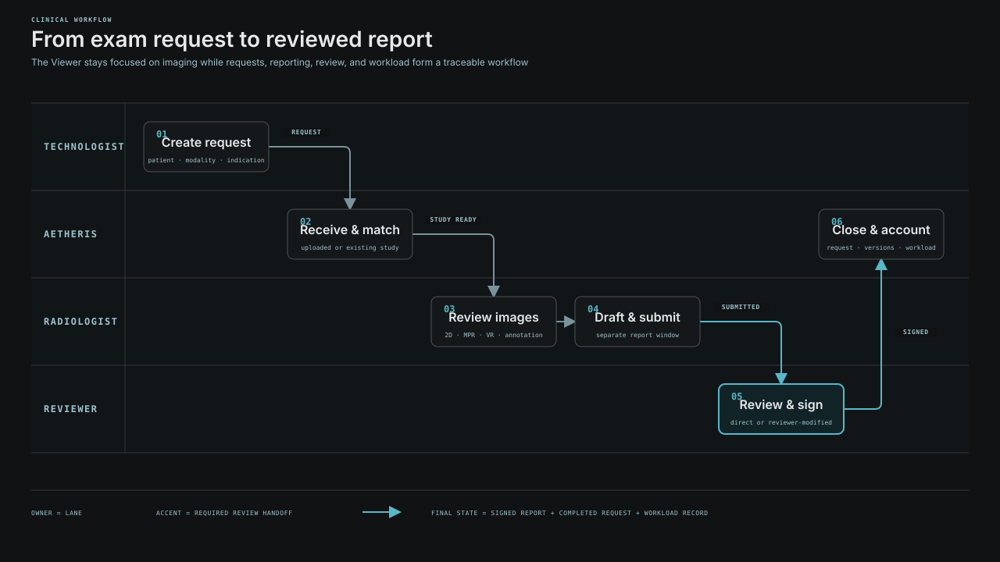
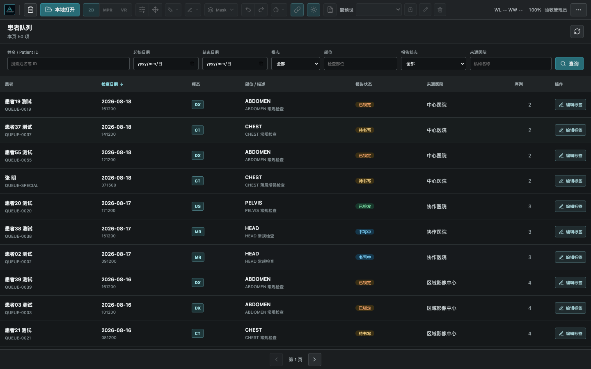
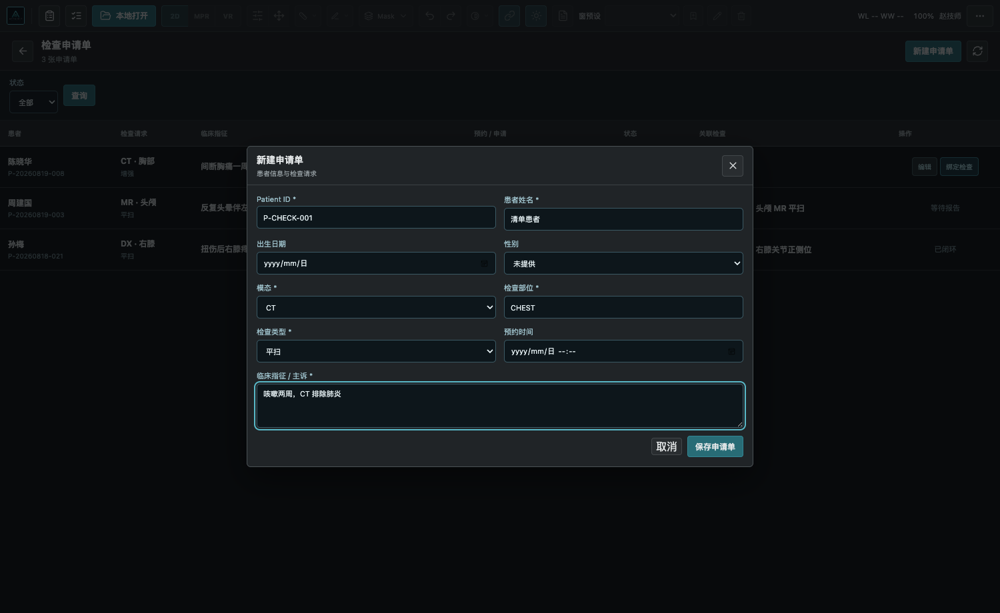
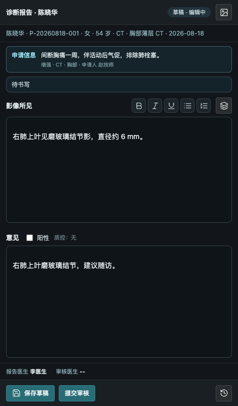
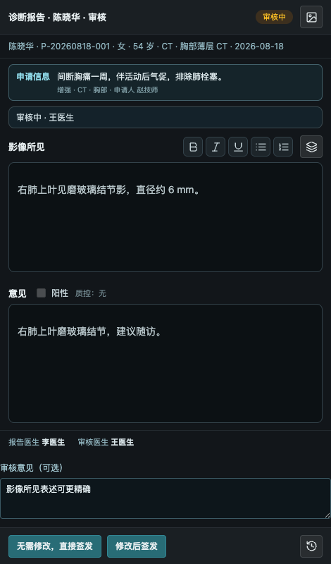
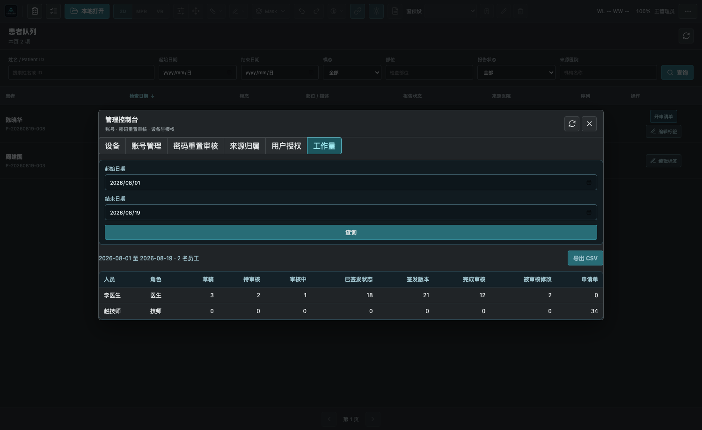
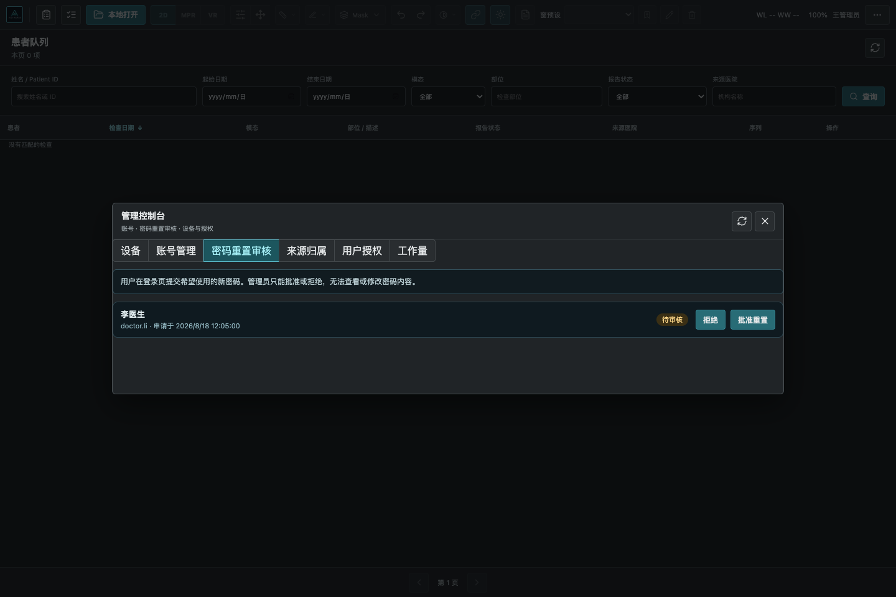
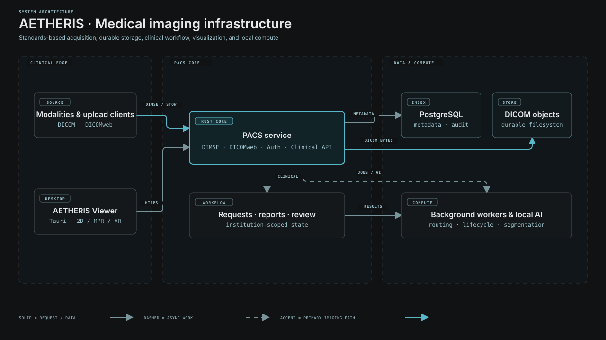
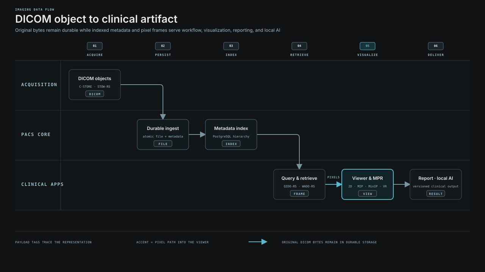
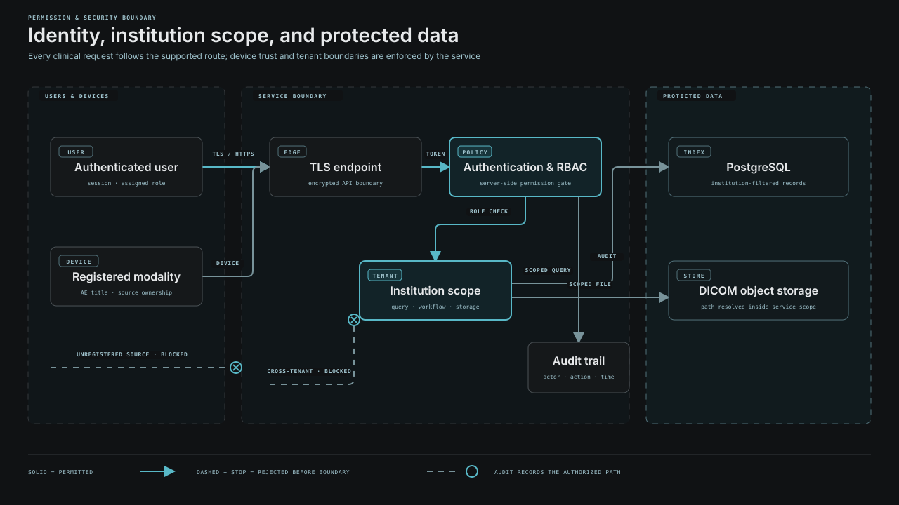

<p align="center">
  
</p>

<h1 align="center">AETHERIS</h1>

<p align="center">
  <strong>Medical imaging, connected from acquisition to reviewed report.</strong><br>
  Self-hosted PACS · Native desktop viewer · Clinical workflow · Local AI
</p>

<p align="center">
  <a href="https://github.com/LQ-1123/AETHERIS/releases">Download</a>
  ·
  <a href="doc/releases/v0.3.0.md">Release notes</a>
  ·
  <a href="doc/api-reference.md">API reference</a>
  ·
  <a href="README.zh-CN.md">简体中文</a>
</p>

<p align="center">


</p>

[English](README.md) · [简体中文](README.zh-CN.md)

---

## Product at a glance

**AETHERIS** is a self-hosted medical imaging platform built around a Rust PACS core and a native Tauri desktop application. It brings DICOM ingestion, durable storage, patient worklists, diagnostic visualization, exam requests, reporting, independent review, administration, and local AI into one institution-scoped system.

| Product surface | Delivered workflow |
| --- | --- |
| **PACS core** | DIMSE and DICOMweb ingestion, metadata indexing, durable object storage, authentication, audit, routing, lifecycle jobs, and clinical APIs |
| **Desktop viewer** | Patient worklist, local DICOM open, 2D reading, multi-series layouts, GPU oblique MPR, MIP/MinIP, volume rendering, measurement, annotation, masks, and local AI segmentation |
| **Clinical workspace** | Exam requests, study matching, separate report windows, draft submission, independent review, immutable signed versions, account administration, and workload reporting |

The platform keeps the Viewer focused on imaging while workflow state and permissions remain server-owned, auditable, and institution-scoped.

## Release v0.3.0

v0.3.0 connects the worklist, exam request, image review, reporting, independent review, account administration, and workload reporting into a complete desktop workflow.

| Platform | Package | SHA-256 |
| --- | --- | --- |
| macOS Apple Silicon | [AETHERIS_0.3.0_aarch64.dmg](https://github.com/LQ-1123/AETHERIS/releases/download/v0.3.0/AETHERIS_0.3.0_aarch64.dmg) | `f454761759d07acca4bccaf9d0a1af447425a9edaaebbf12c98719d8782dfa78` |
| Windows 10/11 x64 | [AETHERIS-Setup-0.3.0-x64.exe](https://github.com/LQ-1123/AETHERIS/releases/download/v0.3.0/AETHERIS-Setup-0.3.0-x64.exe) | `a926a5c479071f6b9d41722fa3a9c6915047e3b733ce98e86e198df4b614ea67` |

Both desktop packages include the Viewer, `pacsd`, and a local PostgreSQL runtime. See the [v0.3.0 release notes](doc/releases/v0.3.0.md) for the complete change and validation record.

## Clinical workflow

<p align="center">
  
</p>

The same study identity follows the workflow end to end: request creation, image receipt or matching, diagnostic review, report drafting, submission, review, signing, request completion, and workload accounting.

### Worklist and exam requests

The patient worklist is the desktop entry point. It provides server-side pagination and sorting plus combined filters for patient, date, modality, body part, report state, and source institution. Double-clicking a study opens its complete study/series context in the Viewer.

Exam requests support both operational sequences:

- Create the request first, receive the images later, then manually match the study.
- Create a request directly from an existing study; patient and Study data are resolved by the server.

Requests carry modality, body part, exam type, clinical indication, appointment information, linked study, and a traceable state from pending execution through completion.

<table>
  <tr>
    <td width="50%"></td>
    <td width="50%"></td>
  </tr>
  <tr>
    <td align="center"><sub>Patient study worklist · filtering, sorting, report status, source institution</sub></td>
    <td align="center"><sub>Exam request · patient, modality, body part, exam type, and clinical indication</sub></td>
  </tr>
</table>

### Diagnostic viewing

The native Viewer supports local files and remote PACS studies with a shared reading toolset:

- Window/level, presets, zoom, pan, cine navigation, inversion, flip, and rotation.
- Up to 3×3 multi-series layouts with independent pane state.
- Patient-space GPU oblique MPR with linked axial, coronal, and sagittal planes.
- MIP, MinIP, GPU volume rendering, and physical-space measurements.
- Length, angle, arrow, rectangle, ellipse, ROI statistics, and synchronized annotations.
- 3D sparse masks and local AI segmentation with no cloud image upload requirement.

<table>
  <tr>
    <td width="50%"></td>
    <td width="50%"></td>
  </tr>
  <tr>
    <td align="center"><sub>Multi-series comparison · independent panes and shared study context</sub></td>
    <td align="center"><sub>GPU oblique MPR · rotatable reference lines and linked patient-space planes</sub></td>
  </tr>
  <tr>
    <td width="50%"></td>
    <td width="50%"></td>
  </tr>
  <tr>
    <td align="center"><sub>GPU volume rendering · windowing, rotation, pan, and zoom</sub></td>
    <td align="center"><sub>Local AI segmentation · editable 3D masks and quantitative results</sub></td>
  </tr>
</table>

### Reporting and independent review

Reports open in a separate desktop window so image interaction stays uninterrupted. A report is attached to one study and includes structured findings, impression, recommendation, positive-result marking, templates, linked request information, and a complete review timeline.

When institution review is enabled, the author can **Save draft** or **Submit for review**. A user with `review_report` permission can start review and either sign the submitted report unchanged or modify it before signing. The system preserves author identity, reviewer identity, review comments, audit events, and immutable signed-version snapshots; authors cannot review their own reports.

<table>
  <tr>
    <td width="50%" align="center"></td>
    <td width="50%" align="center"></td>
  </tr>
  <tr>
    <td align="center"><sub>Radiologist workspace · Save draft / Submit for review</sub></td>
    <td align="center"><sub>Reviewer workspace · Sign unchanged / Modify and sign</sub></td>
  </tr>
</table>

### Administration and workload

The administration console combines institution-scoped controls for devices, accounts, password-reset review, source ownership, user permissions, workload, and report-review settings.

- Create, activate, deactivate, and revoke sessions for institution accounts.
- Require a password change at first sign-in.
- Let users submit a username and new password from the login screen; administrators approve or reject the request without seeing the password.
- Register DICOM devices, bind sources to institutions, and grant device visibility to users.
- Grant report-review permission and enable the institution review workflow.
- Aggregate drafts, pending review, active reviews, signed versions, completed reviews, reviewer modifications, and exam requests by user and date range; export results as CSV.

<table>
  <tr>
    <td width="50%"></td>
    <td width="50%"></td>
  </tr>
  <tr>
    <td align="center"><sub>Workload report · reporting, review, version, and request counts</sub></td>
    <td align="center"><sub>Password reset review · administrator approves or rejects without reading the new password</sub></td>
  </tr>
</table>

## System architecture

<p align="center">
  
</p>

The Rust service terminates DIMSE, DICOMweb, authentication, and clinical APIs. PostgreSQL stores indexed and workflow metadata; the object store preserves DICOM datasets; background workers execute routing, lifecycle, transfer, revision, and AI jobs. The desktop application reaches this boundary through authenticated HTTPS and never owns database credentials.

## Imaging data flow

<p align="center">
  
</p>

Incoming Part 10 objects are persisted durably and indexed into the patient/study/series/instance hierarchy. QIDO-RS serves searchable metadata; WADO-RS returns objects and frames to the Viewer. Visualization, reporting, annotation, and local AI consume those server-resolved study identities while the original DICOM object remains the durable source.

## Security and permissions

<p align="center">
  
</p>

Security decisions are enforced at the service boundary:

- TLS-protected HTTP endpoints and signed user sessions.
- Argon2id password hashing and server-reviewed password-reset requests.
- Fixed roles plus explicit permission grants for sensitive operations.
- Institution filtering on worklists, DICOMweb retrieval, reports, requests, devices, jobs, and administrative APIs.
- Device identity and source-ownership checks before images enter an institution scope.
- Audit events for authentication, data access, report review, password reset, device, permission, routing, revision, and lifecycle actions.

## Standards and interoperability

Only implemented protocol surfaces are listed here.

| Family | Service | Delivered behavior |
| --- | --- | --- |
| DIMSE | C-ECHO SCP | Connectivity verification |
| DIMSE | C-STORE SCP | Durable DICOM object receipt with transfer-syntax negotiation, including RLE Lossless |
| DIMSE | C-FIND SCP | Patient, study, series, and instance hierarchy queries |
| DIMSE | C-MOVE SCP / SCU | Study Root retrieval with destination allowlisting and C-STORE ingestion |
| DIMSE | C-GET SCP | Same-association Study Root retrieval with sub-operation counters |
| DICOMweb | QIDO-RS | Authenticated, institution-scoped metadata search |
| DICOMweb | WADO-RS | Authenticated object, instance, metadata, and frame retrieval |
| DICOMweb | STOW-RS | Multipart DICOM Part 10 ingestion |

The server preserves original DICOM bytes, handles common character-set variations, performs idempotent indexing, and acknowledges a C-STORE object only after the durable storage path succeeds.

## Install and run

### Desktop packages

Download the current DMG or EXE from [GitHub Releases](https://github.com/LQ-1123/AETHERIS/releases). The desktop package initializes and launches the local PACS stack through the AETHERIS application:

| Platform | Application data |
| --- | --- |
| macOS Apple Silicon | Application bundle plus the packaged local service stack |
| Windows 10/11 x64 | Program files under `C:\Program Files\AETHERIS`; database, images, configuration, and logs under `C:\ProgramData\AETHERIS` |

### Docker service stack

Docker Compose starts PostgreSQL, `pacsd`, persistent DICOM storage, and the DCMTK simulator:

```bash
cp .env.example .env
# Set strong POSTGRES_PASSWORD, PACS_ADMIN_PASSWORD, and PACS_JWT_SECRET values.
docker compose up -d --build
docker compose logs -f pacsd
```

Service endpoints:

- PACS API and DICOMweb: `https://127.0.0.1:8443`
- DIMSE SCP: `127.0.0.1:11112` with AE Title `REMOTE_PACS`
- API inspection page: `https://127.0.0.1:8443/api-checker`
- DCMTK simulator: `http://127.0.0.1:8787`

### Development

Requirements: Rust 1.97+, Node.js 20+, PostgreSQL 14+, `libarchive`, and platform dependencies for Tauri 2.

Start the service:

```bash
cp .env.example .env
# Configure DATABASE_URL, PACS_JWT_SECRET, and storage paths in .env.
cargo run -p pacsd
```

Start the desktop application in another terminal:

```bash
cd apps/viewer
npm ci
npm run tauri dev
```

Build distributable applications:

```bash
cd apps/viewer
npm ci
npm run tauri build
```

The Windows all-in-one installer is built with the manually triggered [Build Windows Installer](.github/workflows/build-windows.yml) workflow or `packaging/windows/build.ps1` on a prepared Windows host.

## Engineering validation

The repository CI runs formatting, linting, unit/integration tests, PostgreSQL-backed database tests, and DCMTK interoperability traffic. The v0.3.0 release also records the desktop frontend suite and package-integrity checks.

```bash
cargo fmt --all -- --check
cargo clippy --workspace --all-targets -- -D warnings
cargo test --workspace

cd apps/viewer
npm ci
npm run build
npm test
```

## Documentation

- [v0.3.0 release notes](doc/releases/v0.3.0.md)
- [Clinical and administrative API reference](doc/api-reference.md)
- [System introduction and engineering design](doc/remote-pacs-system-introduction.md)
- [Implemented function summary](doc/system-function-summary.md)
- [DCMTK test-platform integration](doc/dcmtk-test-platform-integration.md)
- Live API inspection page at `/api-checker`

## Use boundary

AETHERIS is distributed for medical-imaging research, engineering evaluation, and controlled institutional deployment. Clinical use requires institution-specific validation, security configuration, operating procedures, and regulatory review. Protect credentials, TLS keys, databases, DICOM storage, exports, and screenshots according to applicable healthcare data policies.

## License

[MIT](LICENSE)
