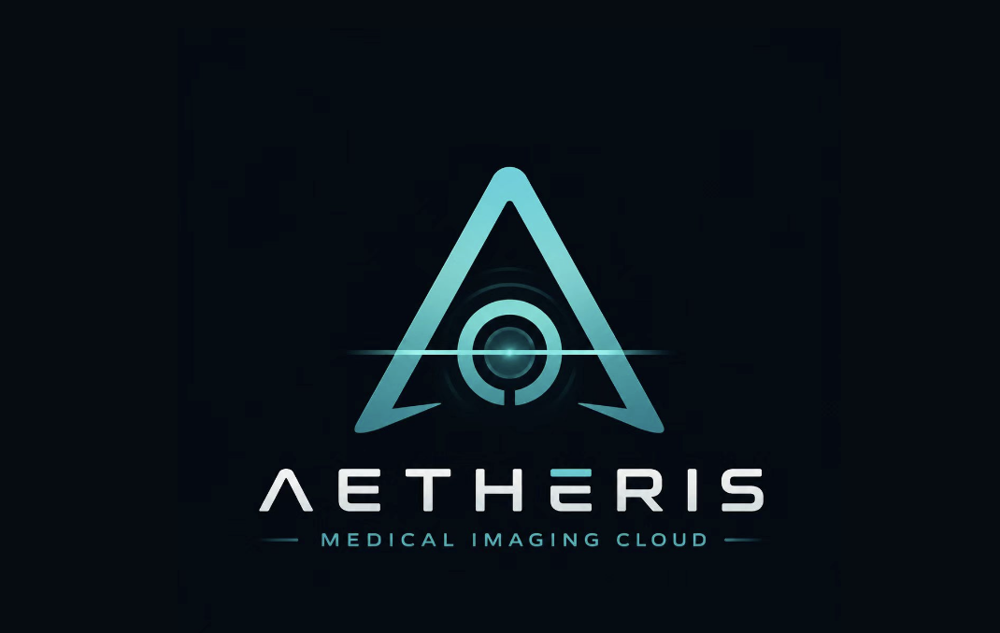
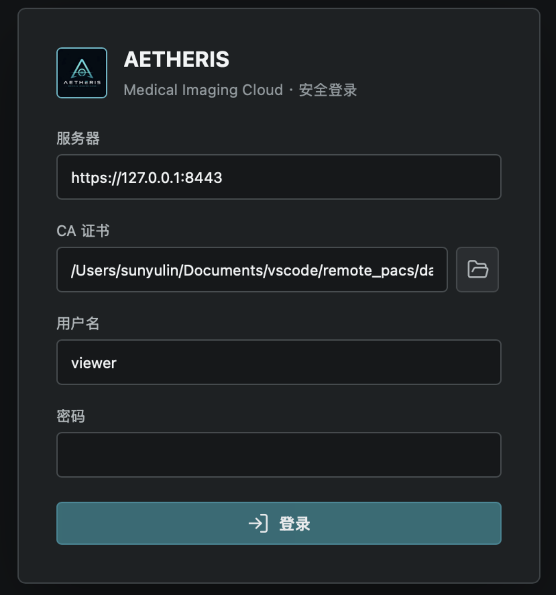
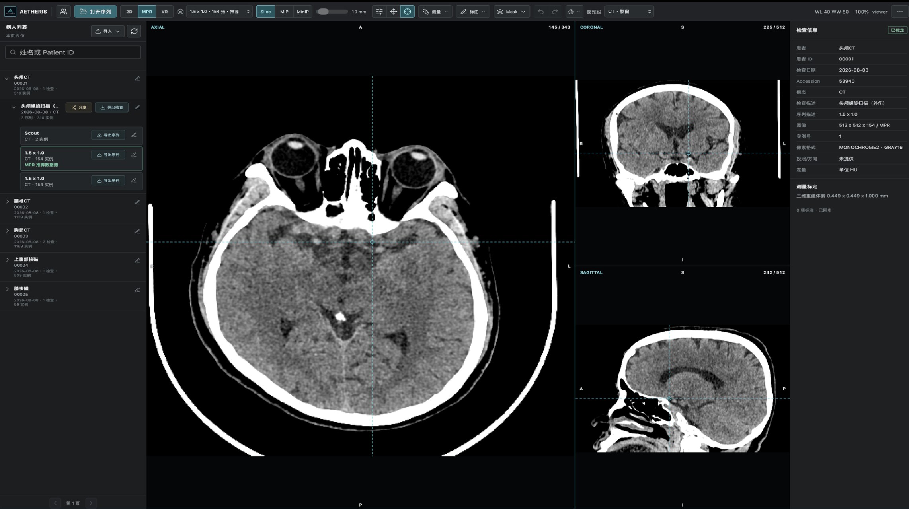
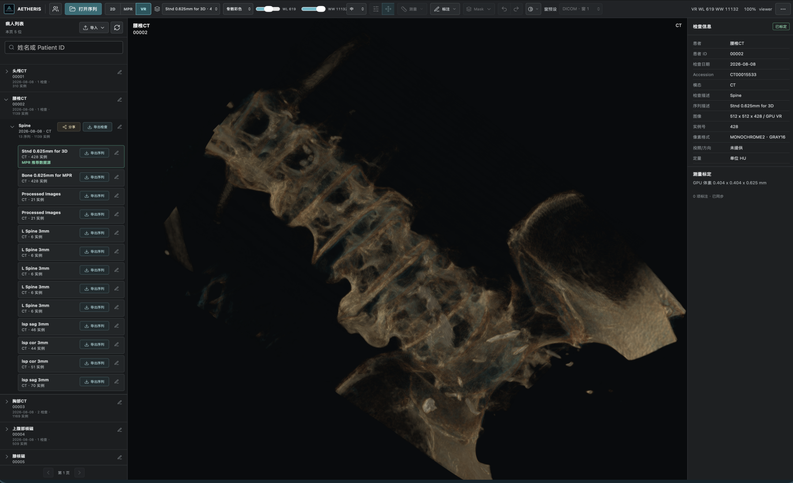
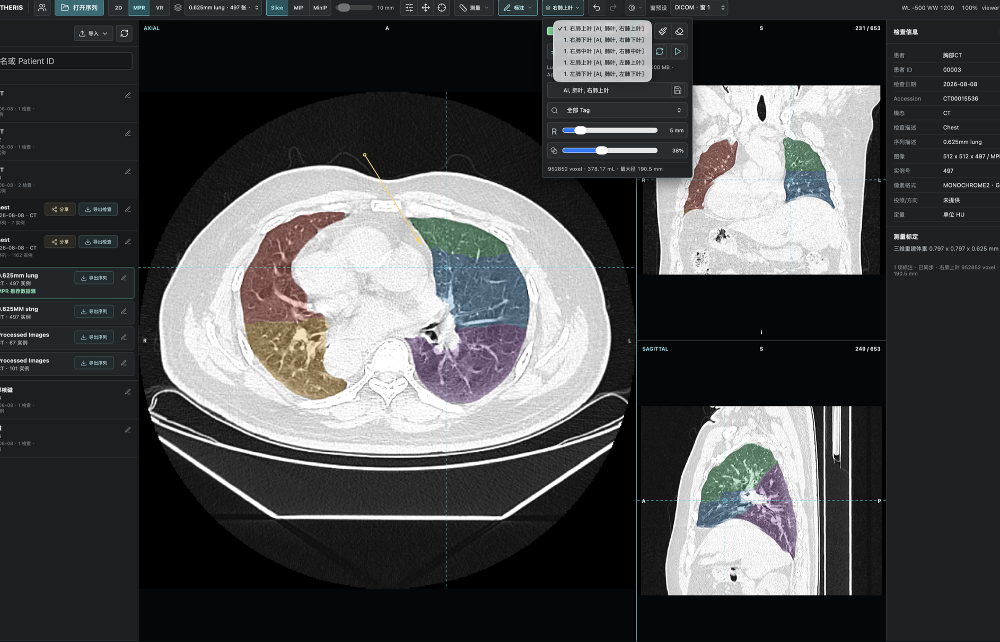
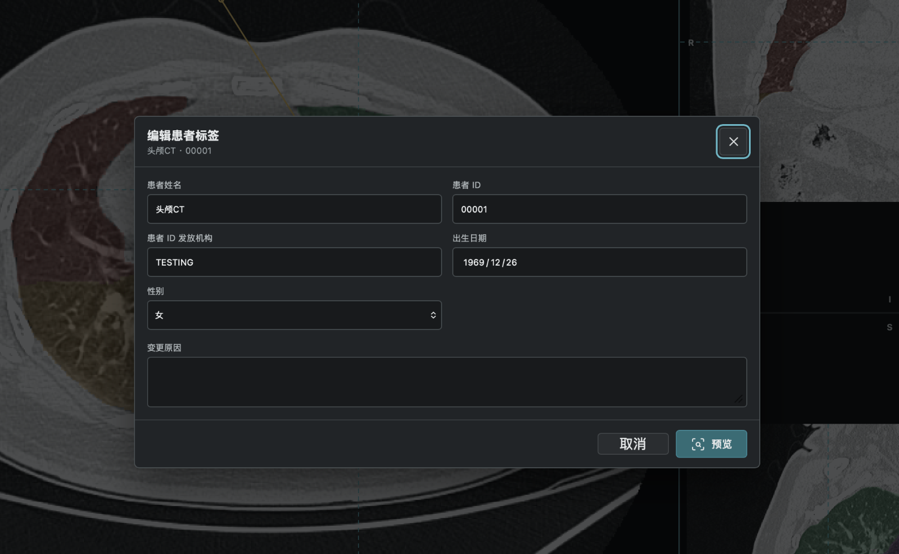
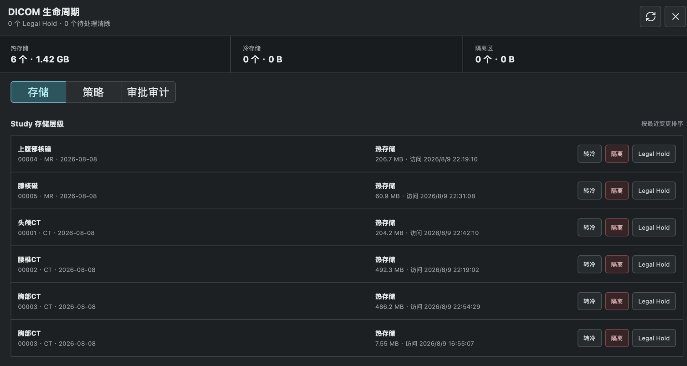
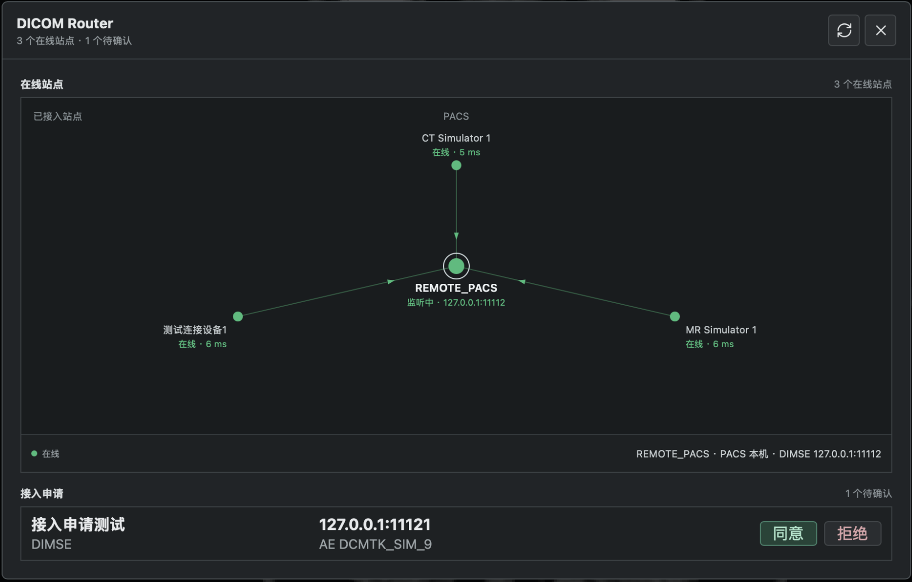

# remote_pacs

[English](README.md) | **中文**

自建 PACS：Rust 服务端 + Tauri 桌面查看器。可分发、多账号、共享平台数据库。

<p align="center">
  
</p>

[](https://github.com/LQ-1123/AETHERIS/actions/workflows/ci.yml)
[](https://github.com/LQ-1123/AETHERIS/actions/workflows/build-windows.yml)
[](https://github.com/LQ-1123/AETHERIS/releases)
[](LICENSE)

## 界面截图

| 登录 | 病人列表 | 查询 |
|---|---|---|
|  |  |  |

| MPR 三维重建 | VR 体渲染 | AI 分割 |
|---|---|---|
|  |  |  |

| 标注 | DICOM TAG 修订 | 生命周期 |
|---|---|---|
|  |  |  |

| DICOM 路由引擎 |
|---|
|  |

## 下载


开箱即用安装包（内含 Viewer + 服务端 + PostgreSQL，目标机零依赖）：

| 平台 | 安装包 | 说明 |
|---|---|---|
| Windows x64 | [AETHERIS-Setup-0.1.0-x64.exe](https://github.com/LQ-1123/AETHERIS/releases/latest) | Inno Setup 安装包，双击安装即可使用 |
| macOS (Apple Silicon) | [AETHERIS_0.1.0_aarch64.dmg](https://github.com/LQ-1123/AETHERIS/releases/latest) | 双击即用，自动初始化本地服务与账号 |

> macOS 首次打开如提示"无法验证开发者"，右键 → 打开即可（尚未公证）。
> 仅供研究/演示，未经临床验证。

实施计划见 [`pacs-plan.md`](pacs-plan.md)，Viewer 交接与后续清单见
[`nextplan.md`](nextplan.md)。

## 结构

```
crates/
  pacs-core/    领域模型、UID 校验、DICOM 元数据提取
  pacs-store/   文件落盘、fsync 语义、两级哈希分片路径
  pacs-db/      Postgres 访问层、迁移、入库事务
  pacs-dimse/   自研 DIMSE 服务类(C-ECHO/STORE/FIND/MOVE/GET SCP)
  pacs-auth/    账号、argon2 哈希、token、RBAC、审计
  pacs-web/     axum: QIDO/WADO/STOW-RS + 认证 API
  pacs-codec/   像素解码、缩略图、帧提取
  pacs-ai/      本地 AI Worker 协议、任务取消与 Mask 结果校验
  pacsd/        服务端主程序
apps/viewer/    Tauri 2 客户端(可脱离服务端打开本地 DICOM)
```

进度：阶段 0–4 已完成；阶段 5 的 QIDO-RS/WADO-RS 读取侧已完成，STOW-RS 待做；
阶段 6 的 Viewer 已支持本地文件和经过认证的远程病人工作列表。

## 试一试

先创建管理员账号并启动服务端，再用 DCMTK 模拟设备发送影像：

```sh
cargo run -p pacsd -- admin --username admin --password 'sunyulin'
cargo run -p pacsd

echoscu  -aet TEST_SCU -aec REMOTE_PACS 127.0.0.1 11112
storescu -aet TEST_SCU -aec REMOTE_PACS 127.0.0.1 11112 x.dcm
```

`echoscu` 成功表示关联和 C-ECHO 正常；`storescu` 返回 Success 后，影像已经持久化到
`PACS_STORAGE_ROOT` 并完成 Postgres 分层索引。重复发送相同 SOP Instance UID 不会产生
重复实例。

### DCMTK 多设备模拟器

本地测试可运行 `python3 tools/dcmtk-simulator.py`，然后打开 `http://127.0.0.1:8787`。页面支持拖拽 DICOM 文件夹、配置多台 Calling/Called AE 设备，并发调用 DCMTK `storescu` 上传到 PACS。需先安装 DCMTK（macOS：`brew install dcmtk`）；端口可用 `SIMULATOR_PORT` 修改。

管理员可在服务器上为用户创建固定角色账号：

```sh
cargo run -p pacsd -- user create --username doctor01 --password 'replace-with-a-strong-password' --role radiologist
cargo run -p pacsd -- user create --username technician01 --password 'replace-with-a-strong-password' --role technician
cargo run -p pacsd -- user create --username viewer01 --password 'replace-with-a-strong-password' --role viewer
```

可选角色为 `admin`、`radiologist`、`technician` 和 `viewer`。命令必须在能读取
服务端 `.env` 并连接 PACS 数据库的环境中执行；系统不提供公开注册入口。

## Docker 快速开始

一条命令起服务端全套：Postgres + pacsd + DCMTK 设备模拟器（需要 Docker 与
Compose v2；Tauri Viewer 是桌面应用，仍在宿主机运行）。

```sh
docker compose up -d --build   # 首次构建 pacsd 镜像（release 编译约 10-20 分钟）
docker compose logs -f pacsd   # 看初始化日志：建库 → 迁移 → 创建管理员
```

启动后：

- **HTTPS/DICOMweb**：`https://127.0.0.1:8443`（自签证书，首次启动自动生成，
  存在 `data/docker-storage/tls/ca.crt`）
- **DIMSE**：`127.0.0.1:11112`，可直接用 `echoscu`/`storescu` 对接
- **设备模拟器**：`http://127.0.0.1:8787`，拖入 DICOM 文件夹即可并发上传
  —— 设备配置里"主机"填 `pacsd`、端口 `11112`
- **默认管理员**：`admin / pacs-demo-2026`（默认密码需 ≥12 位且不能包含
  用户名 "admin"；务必用 `.env` 里的 `PACS_ADMIN_PASSWORD` 覆盖，正式使用
  还需覆盖 `PACS_JWT_SECRET`）

示例影像：

```sh
./tools/fetch-sample-dicom.sh    # 下载公开示例 DICOM 到 data/samples
```

Viewer 在宿主机连接容器：

```sh
cd apps/viewer && npm install && npm run tauri dev
```

登录页填 `https://127.0.0.1:8443`，CA 证书选 `data/docker-storage/tls/ca.crt`，
用管理员或 `pacsd user create` 建的账号登录。本地 AI 分割（lungmask）在 Viewer
内运行，不经过容器。

容器内默认以 root 运行（演示用途；正式部署建议换非 root 用户并加固 TLS 证书）。

## 打包发行

**macOS（零依赖 dmg）**：`npm run tauri build` 自动组装本地栈（pacsd + 内嵌
PostgreSQL 14 + 依赖库，脚本 `scripts/stage-local-stack.sh`），产物
`apps/viewer/src-tauri/target/release/bundle/dmg/*.dmg`。双击即用：自动 initdb、
起服务、建管理员、自动登录。

**Windows（开箱即用 exe）**：GitHub Actions 的 `.github/workflows/build-windows.yml`
（手动触发或打 `v*` 标签）在 windows-latest 上编译 pacsd + aetheris-launcher +
Viewer，下载 EDB PostgreSQL 二进制与 vcpkg libarchive，用 Inno Setup 组装
`AETHERIS-Setup-0.1.0-x64.exe` 并上传为 artifact。安装时 `initialize.ps1`
完成 initdb/建库/建管理员，启动器一键拉起全部服务。

## 开发环境

需要 Rust 1.97.1(由 `rust-toolchain.toml` 自动选择)、PostgreSQL、DCMTK。

```sh
cargo build --workspace
cargo test --workspace
cargo clippy --workspace --all-targets -- -D warnings
```

### API 检测中心

启动 `pacsd` 后打开 `https://127.0.0.1:8443/api-checker`。页面会自动读取
`/api/v1/openapi.json` 并合并 DICOMweb、Viewer、标注、分割和传输路由，支持登录、
单接口请求、认证防护批量扫描、GET 冒烟测试及检测结果 JSON 导出。批量检测不会自动
执行写接口；`POST`、`PUT`、`PATCH` 和 `DELETE` 必须填写参数后手动发送，避免误改
临床数据。

### Viewer

Viewer 支持单文件多帧和同一 Study/Series 的多文件灰度序列。多文件序列严格按
`ImagePositionPatient`/`ImageOrientationPatient` 排序；缺少可靠几何时拒绝打开，
不会退回文件名或 `InstanceNumber` 猜测顺序。同一 Series 混有定位像或不同尺寸时，
Viewer 会按几何朝向和尺寸拆成独立图像组，默认打开帧数最多的主堆栈，并可在阅片区
右上角切换其他图像组。

```sh
cd apps/viewer
npm install
npm run build
npm test
npm run tauri dev
```

启用轻量本地肺部分割：

```sh
./ai-worker/setup.sh
npm run tauri dev
```

默认模型为 `lungmask R231`，权重约 119 MB，首次推理时下载。Apple Silicon 会自动
使用 MPS；DICOM 仅由本地 Worker 读取，不上传到推理服务。可通过
`PACS_AI_PYTHON` 和 `PACS_AI_WORKER` 替换 Python 环境或兼容 Worker。

登录时使用默认地址 `https://127.0.0.1:8443`，CA 证书选择
`<PACS_STORAGE_ROOT>/tls/ca.crt`。登录成功后可以按姓名或 Patient ID 搜索，依次展开
病人、检查和序列；点击序列会下载完整 DICOM 后进入阅片。列表在登录时自动加载，
DCMTK 新发送影像后点击刷新即可看到。

当前工具包括窗宽窗位、光标锚定缩放、平移、序列导航、窗预设和两点测距。
普通滚轮切换帧，`Ctrl + 滚轮`缩放，中键拖动平移。
测距会区分已标定毫米、探测器平面毫米和仅像素三种结果。

### 数据库

服务端独占数据库连接，客户端不直连。连接串通过 `.env` 提供：

```sh
cp .env.example .env   # 然后填入真实密码
```

本机开发环境：`postgresql@14`（brew）跑在 **5433** 端口——5432 被系统级
PostgreSQL 18（`/Library/PostgreSQL/18`，另一套独立安装）占用，两者互不影响。
`pacs`（开发）和 `pacs_test`（集成测试）两个库、`pacs` 角色已建，密码在 `~/.pgpass`：

```sh
/opt/homebrew/opt/postgresql@14/bin/psql -h 127.0.0.1 -p 5433 -U pacs -d pacs
```

数据库迁移在 `pacsd` 启动时自动应用，也随二进制编译进去，部署时不用带 SQL 文件。

### 测试

`pacs-db` 的集成测试跑在真实 Postgres 上（那些 SQL 只有真库能验证），
`pacsd` 的互操作测试会启动服务端并用 DCMTK 的 `echoscu`/`storescu` 打真实流量
（自己写的客户端测自己写的服务端，只能证明两边的误解一致）。

两者都需要 `PACS_TEST_DATABASE_URL`，互操作测试还需要 DCMTK。缺少时会打印提示
并跳过；`CI` 环境变量存在时跳过会直接判失败，避免"绿了但其实没测"。

测试库不存在会自动创建，不用先手动 `createdb`。

### 基准

```sh
cargo run --release -p pacsd --example bench_ingest -- 200 8 512
#                                                      份数 并发 边长
```

测的是 C-STORE 回成功之前必须完成的链路：解析 → 落盘 fsync → 事务提交。
必须 `--release`，debug 构建下 DICOM 解析慢一个数量级。

## 设计要点

几个关键约束，改动前请先读计划里的对应章节：

- **客户端绝不直连数据库。** 软件要分发到不同机器和账号，内嵌连接串等于把库
  凭据发给每个用户 —— 无法做权限控制、无法吊销、无法轮换。
- **UID 在入库前必须校验。** UID 直接作为文件路径分量使用，而它来自外部设备。
  `pacs_core::Uid` 保证构造成功的值都是安全的单级路径名。
- **C-STORE 回成功之前数据必须真的持久化。** 顺序是：写临时文件 → fsync →
  rename → fsync 父目录 → 数据库事务提交 → 才回 `0x0000`。设备收到成功响应
  后真的会删本地副本。
- **命令集永远是 Implicit VR Little Endian**，与数据集协商出的传输语法无关
  （PS3.7 §6.3.1）。按协商结果去解命令集，遇到显式 VR 的连接就会解出乱码。
- **落盘的数据集字节与发送方原样一致。** 只在前面拼文件元信息，不解码再重编码
- **CT 序列排序不能用 `InstanceNumber`。** 要按 `ImagePositionPatient` 在切片
  法向量上的投影排。

## 安全须知

- DIMSE 协议本身无认证（AE Title 可伪造）；HTTP 读取接口使用 TLS、账号和权限控制。
  服务端默认只绑 `127.0.0.1`，绑定其他地址会在启动日志里告警。
- 当前自签证书只包含回环地址，本阶段不要直接改为局域网或公网监听。真实设备接入前
  还需要配置正式证书 SAN、网络访问控制和设备白名单。
- 真实病人数据涉及 HIPAA / GDPR /《个人信息保护法》合规要求。

## License

[MIT](LICENSE)
