iAiTHERIS

<p align="center">
  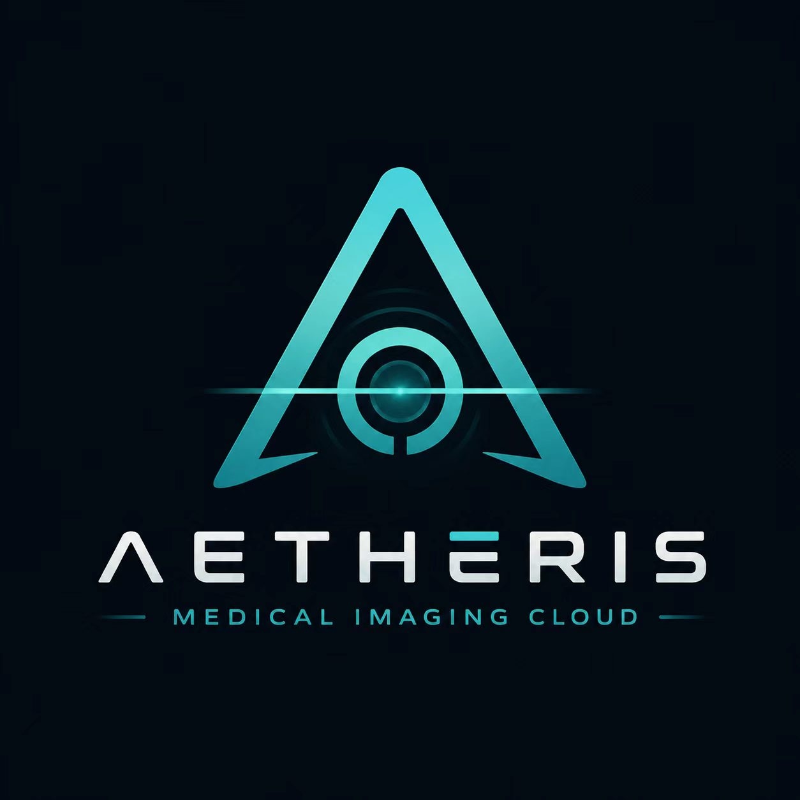
</p>

<h3 align="center">现代化自托管医学影像基础设施</h3>

<p align="center">
  <strong>纯 Rust 从零构建。</strong><br>
  DICOM · DICOMweb · PACS · 2D/3D 可视化 · 本地 AI · 安全工作流
</p>

<p align="center">
  <a href="https://github.com/LQ-1123/AETHERIS">GitHub</a>
  ·
  <a href="https://github.com/LQ-1123/AETHERIS/issues">Issues</a>
  ·
  <a href="https://github.com/LQ-1123/AETHERIS/releases">Releases</a>
</p>

<p align="center">


</p>

[English](README.md) · **中文**

---

## 概述

**AETHERIS** 是一个自托管的医学影像基础设施，围绕一个简单的理念设计：

> **医学影像应当可互操作、持久可靠、可观测、本地可控。**

AETHERIS 不把 PACS 当作一堆遗留服务的拼凑，而是把它当作一个现代化软件系统来构建——Rust 核心、显式存储保证、标准化网络、原生桌面阅片器与本地 AI 能力。

平台能力包括：

* **DIMSE** 标准 DICOM 网络
* **DICOMweb** 现代 HTTP 互操作
* **持久可靠的医学影像存储**
* **PostgreSQL 元数据索引**
* **原生桌面可视化**
* **MPR / MIP / MinIP / 体渲染**
* **测量与标注**
* **本地 AI 分割**
* **RBAC 鉴权与审计日志**
* **工作列表与报告生命周期管理**
* **Docker 部署**
* **Windows / macOS 可分发安装包**

AETHERIS 既是一个可用的 PACS 平台，也是未来智能医学影像工作流的工程底座。

> **研究 / 工程项目。未经临床验证，不用于诊断或直接临床决策。**

---

## 界面截图

| 登录                               | 病人列表                                  | 2D 阅片                             |
| ---------------------------------- | ----------------------------------------- | ----------------------------------- |
|  |  | 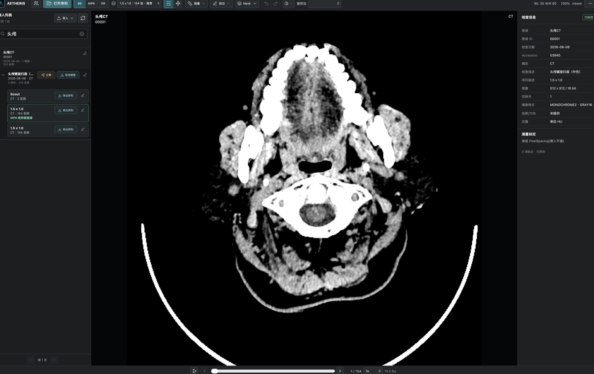 |

| MPR                             | 体渲染                                          | AI 分割                                         |
| ------------------------------- | ----------------------------------------------- | ----------------------------------------------- |
|  |  |  |

| 标注                                     | DICOM TAG 修订                                | 生命周期                                   |
| ---------------------------------------- | --------------------------------------------- | ------------------------------------------ |
| 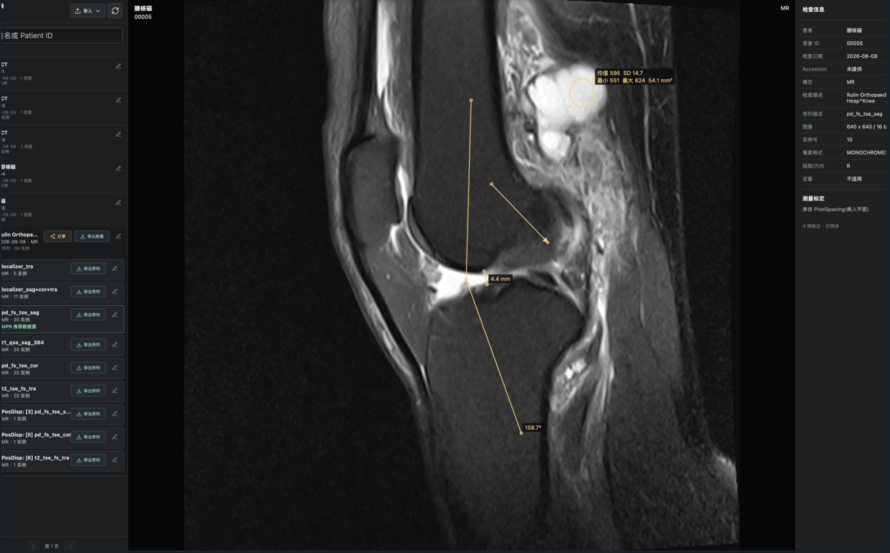 |  |  |

| DICOM 路由引擎                          |
| --------------------------------------- |
|  |

---

## 为什么是 AETHERIS？

传统 PACS 部署往往是一堆紧耦合系统、厂商专属配置、难以在院外复现的基础设施。

AETHERIS 换了一条路：

<p align="center">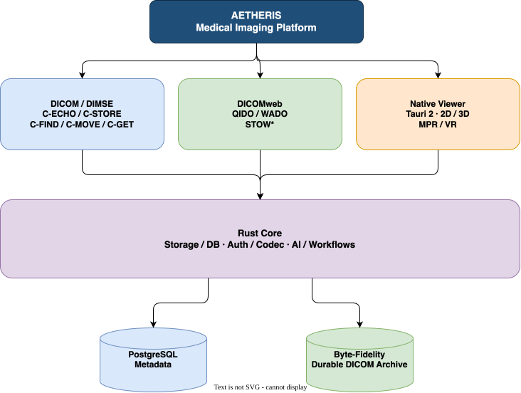</p>

目标不是再造一个 DICOM 阅片器，而是构建一套**完整、可组合的医学影像基础设施**。

---

# 核心能力

## DICOM 网络

AETHERIS 实现了 PACS 互操作所需的核心 DIMSE 服务：

| 服务        | 状态 |
| ----------- | ---- |
| C-ECHO SCP  | ✅   |
| C-STORE SCP | ✅   |
| C-FIND SCP  | ✅   |
| C-MOVE SCP  | ✅   |
| C-GET SCP   | ✅   |

DIMSE 层在 Rust workspace 内实现，而非完全依赖第三方 PACS 服务器——协议层显式、可测、可扩展。

---

## DICOMweb

通过 DICOMweb 提供基于 HTTP 的现代互操作：

| 标准    | 状态      |
| ------- | --------- |
| QIDO-RS | ✅        |
| WADO-RS | ✅        |
| STOW-RS | ✅（Part10）· 🚧 DICOM JSON 变体 |

DICOMweb 在传统设备基础设施与现代 Web 应用之间架起干净的桥梁。

---

## 持久存储

AETHERIS 把影像持久化当作正确性问题而非简单的文件拷贝：

<p align="center">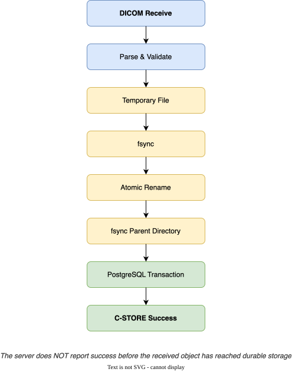</p>

服务端**不会**在收到的对象到达持久存储之前返回成功。

落盘的 DICOM 数据集保留原始字节内容，不做多余的解码 → 重编码。

---

# 原生医学影像阅片器

AETHERIS 内置基于 **Tauri 2** 的原生桌面阅片器，既可作远程 PACS 客户端，也可作本地 DICOM 阅片器。

### 2D 可视化

* 窗宽窗位
* 窗预设
* 缩放 / 平移
* 序列导航
* 多帧支持
* 多文件序列
* 图像测量
* 标注
* 多窗口分屏阅片

### 多窗口分屏阅片

从左侧 **病人 → 检查 → 序列** 中按住序列行拖入工作区，即可自动分屏并同时渲染多个序列：

* 1 个序列：1×1
* 2 个序列：1×2
* 3–4 个序列：2×2
* 5–6 个序列：3×2
* 7–9 个序列：3×3

每个窗格拥有独立的 `Renderer` 与 `ViewState`，可分别浏览、调窗、缩放、平移、测量和标注。点击窗格激活；按住 `Alt` 拖入已有窗格可替换该窗格序列；点击窗格右上角按钮关闭。多窗格模式当前专注 2D 对比阅片，MPR / VR 在单窗格下使用。

<p align="center">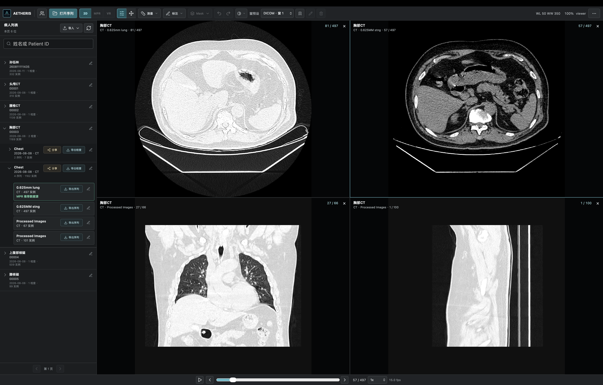</p>

### 几何感知的序列重建

序列排序不依赖文件名或 `InstanceNumber`：

<p align="center">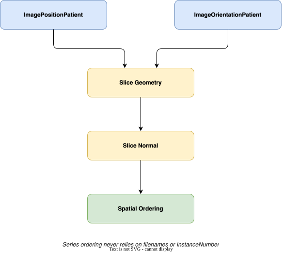</p>

无法建立可靠几何时，阅片器拒绝猜测。

这是有意为之。

> **在医学影像里，顺序错误但看似合理的图像，比显式失败更糟。**

---

# 高级可视化

AETHERIS 不止于基础 2D 阅片，当前可视化能力包括：

* MPR — 多平面重建
* MIP — 最大密度投影
* MinIP — 最小密度投影
* GPU 加速体渲染
* 3D 稀疏 Mask
* 交互式测量
* 标注叠加

### GPU Oblique MPR（任意角度多平面重建）

进入 MPR 后，阅片器会自动加载 GPU Volume，并将 Axial / Coronal / Sagittal 三视图升级为患者空间联动的斜切面重建：

* 每个视图中的十字交叉线就是基准线，直接拖拽离中心稍远的十字线段即可旋转。
* 旋转任意一个视图后，另外两个视图实时沿新方向重建；三个视图始终正交并通过同一患者空间中心点。
* 双击任意视图恢复标准 Axial / Coronal / Sagittal 方向。
* 光标靠近十字线时自动显示旋转光标，避免误触。
* 每个视图右上角显示正方体与当前切面的交面；视图边缘显示动态 `R / L / A / P / S / I`；左上角显示偏转角度和 DICOM `Image Orientation (Patient)` 方向余弦。

几何基础：

* 所有 MPR 平面计算在 Patient Space 中完成，使用 `ImageOrientationPatient`、`ImagePositionPatient`、`PixelSpacing` 和 `Spacing Between Slices` 构建 4×4 仿射变换。
* 斜切面分别计算 `spacingX` / `spacingY`，并根据平面与 Volume 的交集计算 physical FOV 与输出尺寸，支持各向异性体素。
* MPR / MIP / MinIP 从 GPU 3D Texture 实时重采样；16-bit 纹理不可用时使用 RG8 双通道保留 HU 精度。
* 长度和角度测量使用真实物理 spacing，同一解剖结构在不同 MPR 方向保持一致。

<p align="center">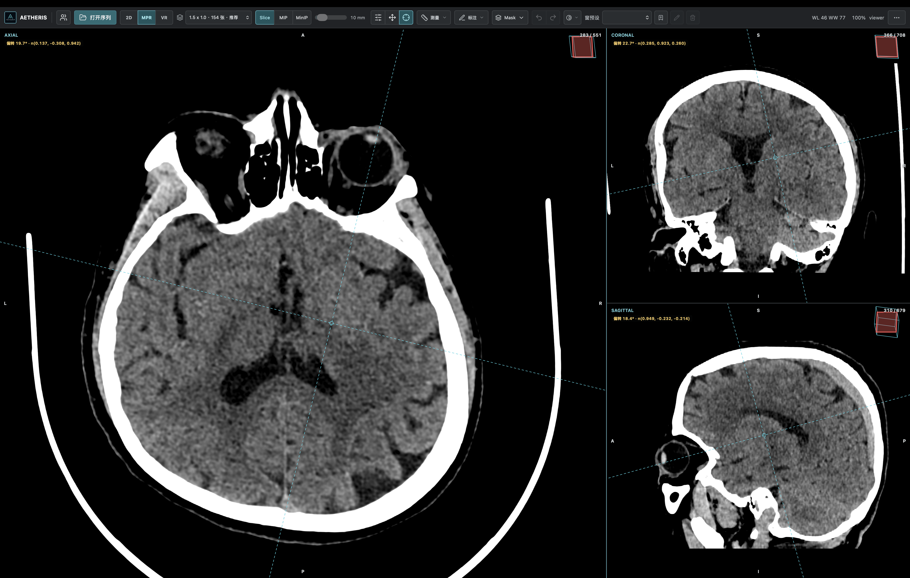</p>

体渲染鼠标手势：

* 左键拖拽 — 窗宽 / 窗位
* 右键拖拽 — 旋转
* 中键拖拽 — 平移
* 滚轮 — 缩放

架构设计支持逐步演进到更高级的体绘制工作流，且阅片器与服务器实现解耦。

---

# 本地 AI

AETHERIS 提供面向医学图像处理的本地 AI Worker 架构，当前支持基于 **lungmask R231** 的本地肺部分割：

<p align="center">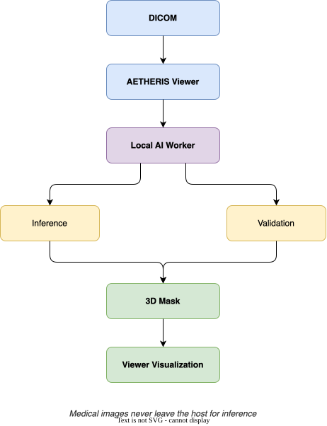</p>

Worker 完全本地运行，医学图像不离开宿主机即可完成推理。Apple Silicon 上可自动使用 **MPS**。

AI 子系统刻意设计为 Worker 边界而非把具体模型塞进 PACS 核心——未来引入新模型和推理引擎无需重构存储与网络层。

---

# 安全与访问控制

AETHERIS 为分布式部署提供应用层安全机制：

* Argon2 密码哈希
* JWT 鉴权
* Refresh Token
* 基于角色的访问控制（RBAC）
* 账号管理
* 审计日志
* 权限感知的 API 访问
* 版本化报告修订
* 生命周期控制

服务端独占数据库连接，客户端绝不直连 PostgreSQL：

<p align="center">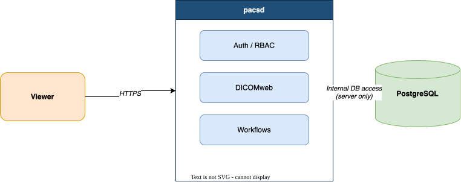</p>

这避免了把数据库凭据分发给每个客户端，在应用层与持久层之间建立清晰的安全边界。

---

# 架构

AETHERIS 按显式子系统边界组织为 Rust workspace：

<p align="center">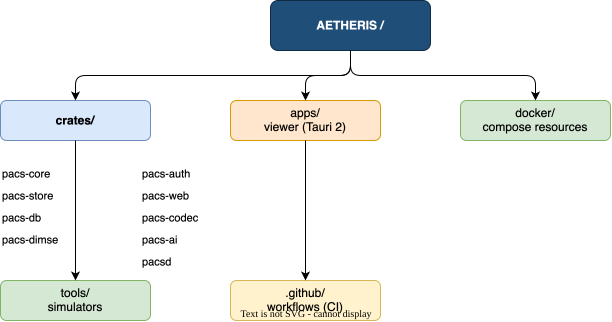</p>

架构刻意分层：

<p align="center">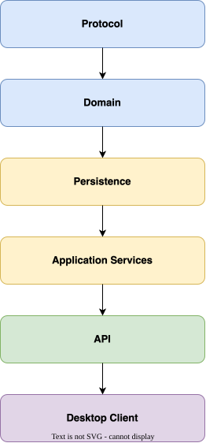</p>

各子系统独立可测、可替换。

---

# 技术栈

| 层        | 技术             |
| --------- | ---------------- |
| 核心语言  | Rust             |
| 桌面      | Tauri 2          |
| 后端 HTTP | Axum             |
| 数据库    | PostgreSQL       |
| DICOM     | DIMSE + DICOMweb |
| 鉴权      | Argon2 + JWT     |
| AI        | 本地 Worker 架构 |
| 容器化    | Docker / Compose |
| macOS     | Apple Silicon    |
| Windows   | x64              |
| License   | MIT              |

---

# 部署

AETHERIS 无需复杂基础设施即可部署。

## Docker

```bash
docker compose up -d --build
```

<p align="center">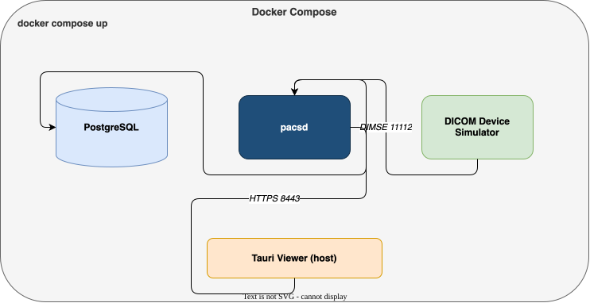</p>

Tauri Viewer 保持为宿主机原生应用。

---

# DICOM 设备模拟

AETHERIS 内置基于 DCMTK 的设备模拟器，用于开发与互操作测试：

```bash
python3 tools/dcmtk-simulator.py
```

模拟器支持：上传 DICOM 文件夹、配置 Calling/Called AE、模拟多台设备、并发传输。

没有物理 CT/MR/CR/DR 设备也能开发和测试 PACS 网络。

---

# 零依赖桌面分发

AETHERIS 可打包为独立的桌面应用：

<p align="center">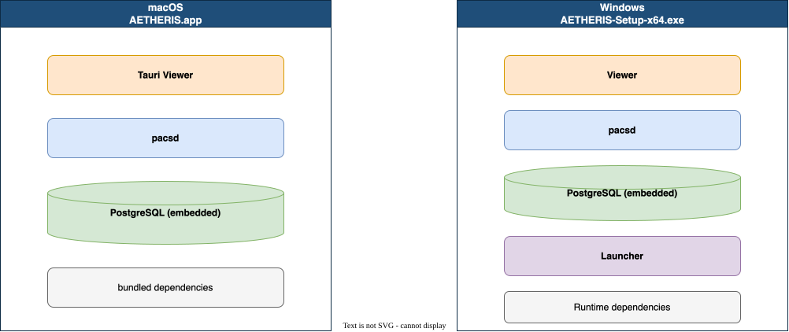</p>

macOS dmg 开箱即用；Windows 安装包目标机无需单独安装 PACS。

---

# 开发

## 环境要求

* Rust 1.97.1+
* PostgreSQL
* DCMTK
* Node.js / npm
* Docker（可选）

## 构建 / 测试 / 检查

```bash
cargo build --workspace
cargo test --workspace
cargo clippy --workspace --all-targets -- -D warnings
```

## 运行阅片器

```bash
cd apps/viewer
npm install
npm run tauri dev
```

---

# 互操作测试

AETHERIS 不只依赖自产流量，还用 DCMTK 对服务器打真实 DICOM 关联：

```bash
echoscu \
  -aet TEST_SCU \
  -aec REMOTE_PACS \
  127.0.0.1 11112
```

```bash
storescu \
  -aet TEST_SCU \
  -aec REMOTE_PACS \
  127.0.0.1 11112 \
  x.dcm
```

这让 DIMSE 实现接受独立 DICOM 实现的验证。

---

# API 检测中心

启动 `pacsd` 后打开 `https://127.0.0.1:8443/api-checker`：

可检查 OpenAPI 路由、DICOMweb 端点、阅片/标注/分割/传输 API、鉴权保护、GET 冒烟测试、JSON 导出。批量检测不会自动执行写接口。

---

# 工程原则

AETHERIS 围绕几条不可妥协的原则构建。

### 1. 先持久，后应答

C-STORE 返回成功时，数据必须已经真正落盘。

### 2. 绝不猜测医学影像几何

CT/MR 排序必须基于空间元数据，而非文件名。

### 3. 保留原始 DICOM 字节

存储不应引入不必要的有损变换。

### 4. 客户端绝不持有数据库凭据

应用服务器是安全与鉴权边界。

### 5. 标准优先于厂商锁定

DICOM 与 DICOMweb 是首要互操作层。

### 6. 本地优先 AI

推理应能不经第三方云服务处理医学图像。

### 7. 显式失败优于静默损坏

系统无法安全确定时，应显式失败，而非静默产生看似合理实则错误的结果。

---

# 项目状态

AETHERIS 处于活跃开发中。

```text
阶段 0 ──────────────────────────────── ✅
核心架构

阶段 1 ──────────────────────────────── ✅
存储 / 数据库

阶段 2 ──────────────────────────────── ✅
DIMSE 基础设施

阶段 3 ──────────────────────────────── ✅
鉴权 / RBAC / 审计

阶段 4 ──────────────────────────────── ✅
PACS 工作流

阶段 5 ──────────────────────────────── 🟡
DICOMweb
QIDO-RS / WADO-RS      ✅
STOW-RS                ✅

阶段 6 ──────────────────────────────── 🟡
原生阅片器
本地 DICOM            ✅
远程工作列表          ✅
2D 可视化             ✅
3D 可视化             ✅
本地 AI               ✅
```

---

# 路线图

长期方向包括：

* [ ] STOW-RS：application/dicom+json 与 bulk-data 变体
* [ ] 扩展 DICOMweb 覆盖
* [ ] 提升 DICOM 设备互操作
* [ ] 高级 MPR / VR 工作流
* [ ] 更多 AI 分割模型
* [ ] AI 辅助影像分析
* [ ] 结构化报告
* [ ] DICOM SR 集成
* [ ] 高级工作列表管理
* [ ] 分布式存储
* [ ] 对象存储后端
* [ ] 多站点部署改进
* [ ] 生产级证书管理
* [ ] 更完善的观测性
* [ ] 扩展自动化互操作测试

目标是让 AETHERIS 从自托管 PACS 演进为更广泛的**医学影像基础设施平台**。

---

# 安全须知

DIMSE 本身不提供强鉴权（AE Title 可伪造）。开发时服务默认绑定回环地址。

真实设备或真实病人数据部署前，必须提供：

* TLS 证书与 SAN 配置
* 网络分段
* 防火墙规则
* 设备白名单
* 凭据管理
* 备份策略
* 访问审计
* 数据保留策略
* 隐私与合规控制

真实病人数据可能受《个人信息保护法》、GDPR、HIPAA 等适用法规约束。

**不要把开发配置直接暴露到公网。**

---

# 临床免责声明

AETHERIS 是研究与工程项目，**未经临床验证**，不是医疗设备。

仓库中的任何内容都不应被理解为：医学诊断、临床建议、经认证的放射工作流、合格医疗专业人员的替代品。

AI 输出为实验性质，不得作为临床决策的唯一依据。

---

# License

AETHERIS 以 [MIT License](./LICENSE) 发布。

---

<p align="center">

**AETHERIS**

*医学影像基础设施，重新构想。*

Rust · DICOM · Tauri · PostgreSQL

</p>
