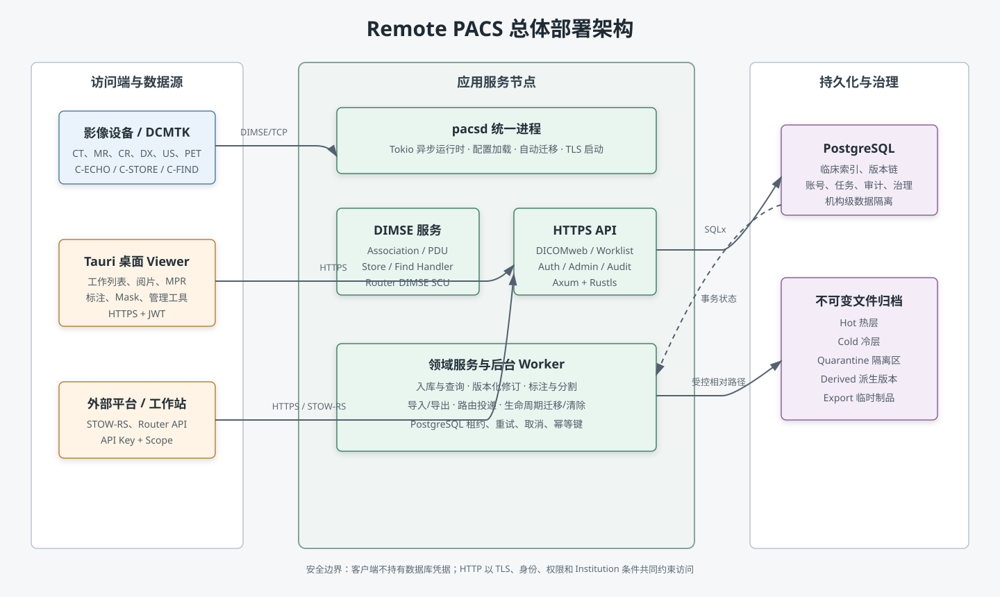
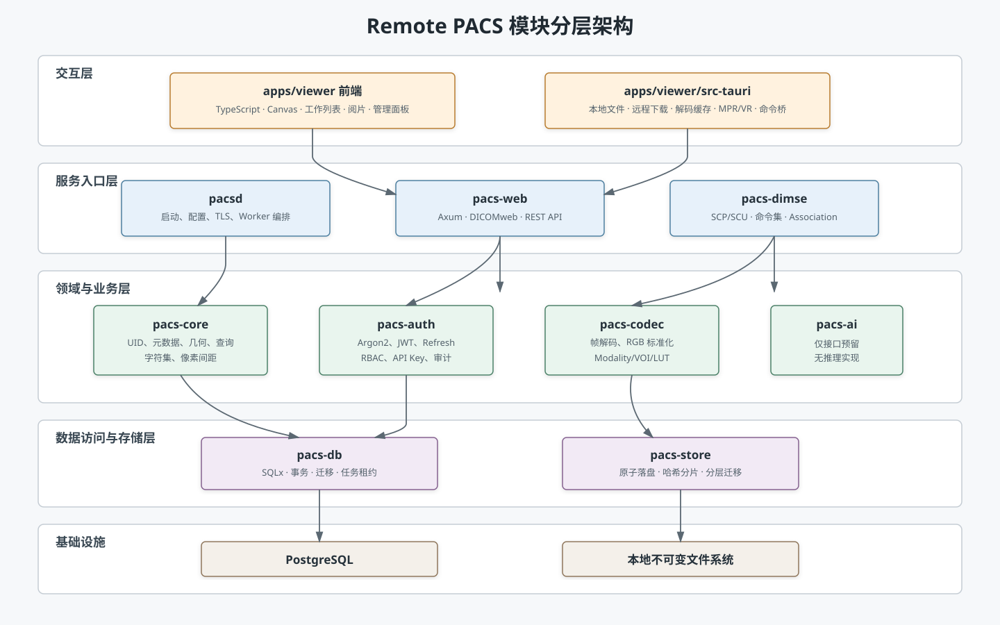
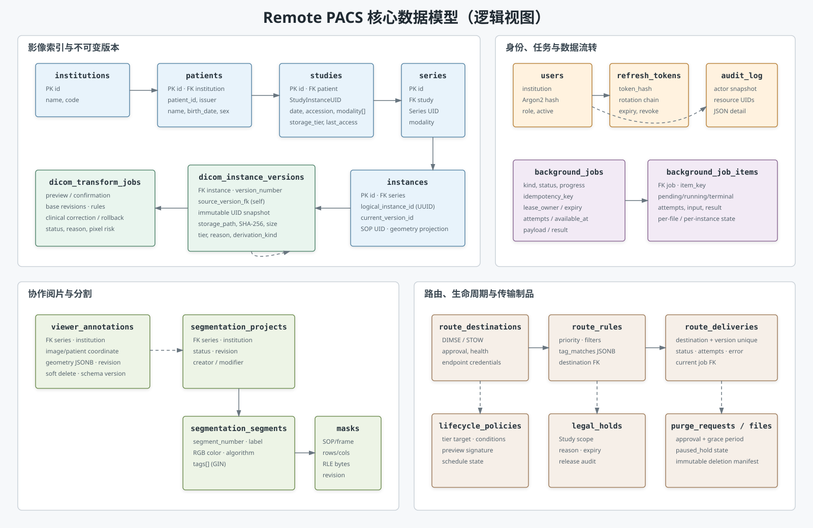
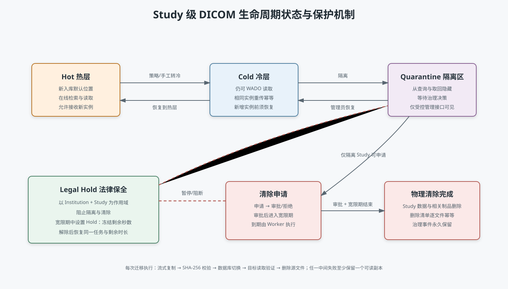
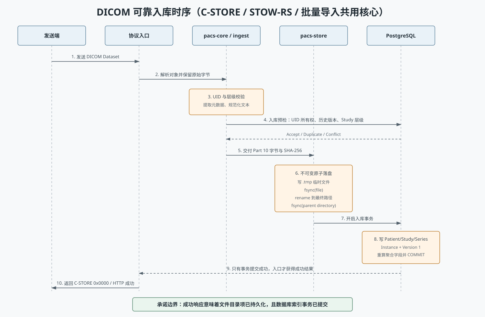
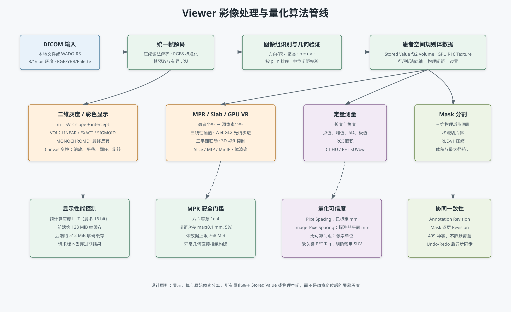

# Remote PACS 医学影像归档与阅片系统的设计与实现

> 文档性质：系统论文式介绍与设计说明
>
> 研究对象：`remote_pacs` 当前工作区源码
>
> 基线日期：2026-08-07
>
> 系统版本：0.1.0
>
> 说明：本文严格区分“已实现能力”和“后续规划”，文中功能均以当前代码、数据库迁移 `0001`—`0018` 和 Viewer 实现为依据。

## 摘要

医学影像归档与通信系统（Picture Archiving and Communication System，PACS）需要在设备互操作、数据持久性、临床查询、图像显示、权限隔离和合规审计之间取得平衡。传统的单体式影像管理程序往往将数据库连接、文件目录和查看逻辑直接暴露给客户端，难以满足多账号分发、访问吊销、数据版本追踪和长期存储治理等要求。为解决上述问题，本文设计并实现了一套以 Rust 为核心的 Remote PACS 系统。系统由 `pacsd` 服务端、PostgreSQL 元数据数据库、不可变 DICOM 文件归档和 Tauri 桌面 Viewer 组成；设备侧通过 DIMSE 协议接入，应用侧通过 HTTPS、DICOMweb 和版本化 REST API 访问。

系统在接收路径上采用“原始字节保真、文件先持久化、数据库后提交、最后返回成功”的一致性策略，通过 UID 校验、SHA-256 摘要、原子重命名与数据库唯一约束实现幂等入库。在查询与阅片路径上，系统提供 C-FIND、QIDO-RS、WADO-RS、STOW-RS、工作列表、二维阅片、多平面重建（MPR）、MIP/MinIP、GPU 体渲染、CT/PET 定量测量、共享标注和三维稀疏 Mask 编辑。针对临床数据修订，系统不覆盖原件，而是维护逻辑实例与不可变版本链，并使用预览、一次性确认、乐观并发控制和像素哈希校验保护修订过程。针对平台运维，系统实现了服务账号、后台任务租约、可恢复导入、ZIP 导出、DIMSE/STOW 路由、冷热分层、隔离区、Legal Hold 和审批清除。

实现结果表明，以强类型领域模型约束 DICOM UID 和空间几何，以 PostgreSQL 维护关系索引与任务状态，以文件系统保存不可变大对象，可以在不让客户端直接接触数据库的前提下形成完整的影像接收、检索、阅片、协作和治理闭环。本文进一步给出系统需求、技术选型、总体架构、数据设计、主要功能和关键算法，并分析当前实现边界与后续演进方向。

**关键词：** PACS；DICOM；DICOMweb；Rust；医学影像；多平面重建；版本化修订；生命周期管理；医学图像分割

---

## 1 绪论

### 1.1 研究背景

DICOM 标准统一了医学影像对象、网络服务和显示相关元数据，但“能够接收一个 DICOM 文件”并不等价于“能够构成可靠的 PACS”。实际系统至少需要解决以下问题：设备收到成功响应后可能立即删除本地副本，因此服务端必须将协议成功码建立在真实持久化之上；不同设备对字符集、实例编号、像素间距和空间方向的填写质量不一致，因此系统不能盲目信任单一 Tag；医学数据修改必须保留原件与责任链，普通文件覆盖不具备可追溯性；桌面客户端需要在多账号环境中分发，不能内嵌数据库凭据；大批量影像导入、远程路由和生命周期迁移均具有长耗时、可重试和可取消的任务属性。

Remote PACS 将这些问题视为同一系统中的一致性与边界设计问题。系统不追求把全部能力放在一个庞大模块中，而是按协议、领域、存储、数据库、认证、Web 和 Viewer 分层，使关键约束能够在最合适的边界上执行。

### 1.2 研究目标

本系统的总体目标是构建一套可本地部署、可向多台工作站分发、支持标准 DICOM 数据流并具有临床数据治理能力的 PACS。具体目标包括：

1. 与常见影像设备和标准工具完成 DICOM 网络互操作。
2. 在成功响应前完成影像文件和索引的可靠持久化。
3. 形成 Institution—Patient—Study—Series—Instance 分层检索模型。
4. 通过 HTTPS 和身份权限向 Viewer 提供受控访问，不允许客户端直连数据库。
5. 提供本地与远程阅片、空间重建、定量测量、共享标注和 Mask 编辑能力。
6. 对临床 Tag 修订、回滚、导入导出、路由和清除操作形成可追溯的任务与审计链。
7. 通过不可变版本、哈希校验、机构隔离和 Legal Hold 降低数据误改、误删和串租户风险。

### 1.3 研究内容与范围

本文研究对象包括服务端 Rust workspace、Tauri 桌面 Viewer、PostgreSQL 数据结构和本地文件归档。系统已经实现 C-ECHO、C-STORE、C-FIND、QIDO-RS、WADO-RS 与 STOW-RS，但尚未实现 C-MOVE/C-GET SCP；Viewer 已覆盖灰度、RGB/YBR/Palette Color、Cine、MPR、MIP/MinIP、基于 Three.js/WebGL2 的 GPU 体渲染和 PET SUVbw 条件计算，但并非对所有可归档 SOP Class 都提供专科级显示；`pacs-ai` 当前只是空的占位 crate，没有推理模型、运行时或任务表实现。上述边界在第 10 章进一步讨论。

---

## 2 需求分析

### 2.1 参与者分析

系统包含五类主要参与者。

| 参与者 | 主要职责 | 典型入口 |
|---|---|---|
| 影像设备或 DICOM 工具 | 连通性检测、影像发送、层级查询 | DIMSE C-ECHO/C-STORE/C-FIND |
| 放射科医生 | 检索、阅片、测量、共享标注、查看修订历史 | Tauri Viewer + HTTPS |
| 技师 | 影像导入、Tag 修订、阅片与质量处理 | Viewer、STOW-RS、管理 API |
| 系统管理员 | 用户、路由、存储生命周期、审批和治理 | Viewer 管理面板、`/api/v1` |
| 外部平台或自动化工作站 | 批量上传、导出、路由和管理集成 | 服务账号 API Key + Scope |

数据库、文件系统和后台 Worker 是系统内部参与者。PostgreSQL 负责关系一致性、任务状态和审计，文件系统负责大对象持久化，Worker 负责长耗时作业；三者不向普通客户端直接开放。

### 2.2 功能需求

表 2-1 给出系统当前需求与实现映射。

| 编号 | 需求描述 | 关键验收条件 | 当前实现 |
|---|---|---|---|
| FR-01 | DICOM 网络连通 | AE Title 匹配，可返回 C-ECHO Success | 已实现 |
| FR-02 | 可靠影像接收 | C-STORE 成功前完成文件同步与数据库提交 | 已实现 |
| FR-03 | DICOMweb 上传 | 支持 `multipart/related` STOW-RS 和鉴权 | 已实现 |
| FR-04 | 幂等与冲突识别 | 同 SOP/同哈希幂等；同 SOP/异哈希拒绝 | 已实现 |
| FR-05 | 层级查询 | Patient/Study/Series/Image 查询及分页 | 已实现 |
| FR-06 | 影像取回 | 完整实例、元数据、指定帧取回 | 已实现 |
| FR-07 | 工作列表 | 患者搜索、检查与序列逐级展开 | 已实现 |
| FR-08 | 身份与会话 | 登录、刷新轮换、退出吊销、强制改密 | 已实现 |
| FR-09 | 权限与租户隔离 | 固定角色、API Scope、Institution 条件 | 已实现 |
| FR-10 | 本地与远程阅片 | 本地文件、WADO 下载、多帧和多文件序列 | 已实现 |
| FR-11 | 图像操作 | 窗宽窗位、缩放、平移、翻转、旋转、反色 | 已实现 |
| FR-12 | 空间重建 | 规则体校验、三平面 MPR、MIP/MinIP | 已实现 |
| FR-13 | 定量工具 | 长度、角度、CT 点值、ROI、PET SUVbw | 已实现（满足 Tag 条件时） |
| FR-14 | 协作标注 | 创建、更新、软删除、增量同步、冲突检测 | 已实现 |
| FR-15 | Mask 分割 | Segment、三维画刷/橡皮、RLE、批量同步 | 已实现首版 |
| FR-16 | 临床 Tag 修订 | 白名单、预览、确认、后台执行、版本链 | 已实现 |
| FR-17 | 修订回滚 | 以历史版本为源创建新版本，不破坏历史 | 已实现 |
| FR-18 | 批量导入与导出 | 分块续传、归档防护、ZIP + manifest | 已实现 |
| FR-19 | DICOM 路由 | DIMSE/STOW 接收端、审批、规则、重试和死信 | 已实现 |
| FR-20 | 生命周期治理 | Hot/Cold/Quarantine、策略、Hold、审批清除 | 已实现 |
| FR-21 | 操作审计 | 记录操作者、结果、资源 UID 和扩展详情 | 已实现，覆盖关键动作 |
| FR-22 | 标准 DICOM SEG 发布 | 将编辑 Mask 发布为标准 SEG 对象 | 尚未实现 |
| FR-23 | AI 推理 | 模型执行、结果落库与自动分割 | 尚未实现 |
| FR-24 | GPU 三维体渲染 | WebGL2 体纹理、传递函数、质量档位和交互视角 | 已实现，受 GPU/WebGL2 能力约束 |

### 2.3 非功能需求

#### 2.3.1 可靠性与一致性

系统必须保证 C-STORE 成功响应具有明确的持久化语义。文件写入不能只停留在操作系统页缓存，目录项也不能仅依赖尚未同步的 `rename`。数据库中不能出现只有 Patient、没有 Instance 的半成品层级。长任务应能在进程退出或租约过期后恢复，重复提交不应重复创建作业或投递。

#### 2.3.2 安全性

客户端不得获得 `DATABASE_URL`。HTTP 访问必须使用 TLS、Bearer 身份和权限校验；数据库查询必须同时带 Institution ID。密码应使用带盐慢哈希，长期机器密钥和 Refresh Token 只保存摘要。外部传入的 UID、相对路径、压缩包条目和 URL 参数必须先验证，避免路径穿越、压缩炸弹和跨机构访问。

#### 2.3.3 互操作性

系统需要遵循 DICOM PS3.4、PS3.7、PS3.10 和 PS3.18 的关键约定，例如 DIMSE 命令集固定使用 Implicit VR Little Endian、DICOMweb 帧号使用 1 基、QIDO 返回 DICOM JSON Model。实现还应通过 DCMTK 和真实 PostgreSQL 验证，避免仅由自研客户端与自研服务端相互测试而掩盖共同误解。

#### 2.3.4 性能与资源边界

系统需要对 DIMSE 数据集大小、查询结果、上传分块、解压条目、体数据、帧缓存和 Mask 请求设置上限。像素解码和 MPR 不应阻塞异步网络执行器；Viewer 应缓存热点帧但必须有确定的内存预算，并丢弃已经过期的异步渲染结果。

#### 2.3.5 可维护性

协议逻辑、领域模型、数据库、文件存储和界面应解耦。数据库迁移需要随二进制部署并可重复验证；Rust workspace 禁止 `unsafe`；核心边界需要单元测试、集成测试、互操作测试和静态检查共同覆盖。

### 2.4 典型用例

**用例一：设备发送 CT 检查。** CT 与 PACS 建立 Association，服务端协商 SOP Class 和传输语法，接收 Dataset，校验 UID 与层级，完成文件原子落盘和数据库事务后返回成功；新实例随后独立触发路由规则，路由失败不影响本地接收结果。

**用例二：医生远程阅片。** 医生使用账号和自签 CA 登录 Viewer，按患者姓名或 Patient ID 搜索，展开检查与序列，下载当前有效版本，完成窗宽窗位、MPR、MIP、测量和标注；共享标注按 Revision 自动同步。

**用例三：技师修订错误 Tag。** 技师选择患者、检查或序列层级，提交白名单 Tag 和原因，先查看影响范围与旧/新值，再使用一次性令牌确认。Worker 基于当前版本生成派生文件，确认 PixelData 哈希不变后事务化激活新版本；历史版本仍可查询和回滚。

**用例四：管理员清理到期检查。** 管理员预演生命周期策略，将 Study 转移到隔离区，提交清除申请并由管理员审批。宽限期结束后 Worker 依据不可变文件清单执行物理删除；若期间建立 Legal Hold，则任务进入暂停状态并冻结剩余宽限时间。

---

## 3 技术选型

### 3.1 选型原则

系统技术选型以类型安全、可验证的失败行为、跨平台分发、协议互操作和低运维复杂度为主要原则。医学影像系统的关键风险通常不在单次计算速度，而在错误数据被静默接受、成功响应早于持久化、多个状态源不一致或几何条件不足时仍生成看似合理的图像。因此，系统优先选择能够显式表达错误、事务和资源所有权的技术。

### 3.2 服务端技术

| 技术 | 用途 | 选型理由 |
|---|---|---|
| Rust 2024 | 服务端、Tauri 后端、图像算法 | 强类型与所有权适合表达 UID、文件句柄、缓存生命周期和并发状态；workspace 禁止 `unsafe` |
| Tokio | 异步运行时 | 同时承载 DIMSE TCP、HTTPS、文件 I/O 与多个 Worker；支持任务隔离和取消 |
| Axum + Tower | HTTP 与中间件 | 路由、State、Extension 和中间件类型清晰，便于将鉴权挂在整棵路由树上 |
| Rustls / Reqwest | TLS 与客户端 HTTP | 纯 Rust TLS 路径，Viewer 可加载用户选择的私有 CA，避免系统外部命令依赖 |
| dicom-rs 0.10 | DICOM 对象与字典 | 提供数据对象、标准 Tag、传输语法、像素解码和 UL 基础能力 |
| 自研 `pacs-dimse` | DIMSE 服务类 | 在 `dicom-ul` 上实现命令解析、状态码、C-STORE/C-FIND SCP 与路由 SCU，控制协议边界 |
| PostgreSQL + SQLx | 元数据、任务和审计 | 事务、外键、唯一约束、JSONB、数组、GIN 索引和 `SKIP LOCKED` 适合复杂一致性需求 |
| SHA-256 | 文件、Token 与制品摘要 | 用于内容寻址判断、不可变冲突检测、Refresh/API Key 摘要和导出 manifest |
| Argon2id + JWT HS256 | 用户认证 | 密码采用慢哈希；短期 Access Token 无状态验证；Refresh Token 可轮换和吊销 |
| compress-tools/libarchive | ZIP/RAR 读取 | 统一归档读取入口，并在应用层实施路径、容量和压缩比限制 |

Rust 服务端没有采用“数据库保存完整 DICOM BLOB”的方式。像素对象通常远大于临床索引，若将全部文件放入 PostgreSQL，会增加备份、WAL、复制和随机读取成本。本系统采用“数据库保存可检索投影与相对路径，文件系统保存不可变对象”的组合，由事务状态和 SHA-256 将两者关联。

### 3.3 客户端技术

Viewer 采用 Tauri 2、TypeScript、Vite、HTML Canvas、Three.js 0.185 和 Lucide Icons。Tauri 允许复用 Rust 的 DICOM、TLS 和像素处理能力，同时保持桌面端安装包和原生文件选择能力。前端使用 Canvas 而非 DOM 图片堆叠，是因为阅片需要逐像素 LUT、多个叠加层、命中测试和稳定的坐标变换。影像 Canvas 与标注 Canvas 分离，二者共享同一个图像到屏幕变换，从而在旋转、翻转、缩放后保持几何对齐。三维模式使用 Three.js 的 WebGL2 Renderer、3D Texture 和 OrbitControls，并由自定义 GLSL Shader 完成体光线步进。

Viewer 未将大型帧通过 JSON/Base64 传给 WebView，而是使用 `pacs-frame://` 自定义协议传输二进制数据。这样可避免 Base64 约 33% 的体积膨胀和额外字符串复制。MPR 与 ROI 数值运算位于 Rust 侧，交互状态、绘制和协作同步位于 TypeScript 侧。

### 3.4 技术选型的边界

PostgreSQL 当前是系统唯一关系数据库实现；本地热层、冷层和隔离区当前均由同一存储根下的命名空间实现，尚未接入 S3/MinIO。HTTP 使用 TLS，但入站 DIMSE SCP 本身没有强身份认证，AE Title 只能用于目标匹配，不能被视为可信身份。系统默认绑定回环地址，生产环境若开放到局域网，仍需正式证书 SAN、设备白名单、防火墙和网络分区。

---

## 4 系统架构设计

### 4.1 总体部署架构



**图 4-1 Remote PACS 总体部署架构**

系统采用服务端集中持有数据库凭据的部署模式。`pacsd` 在一个 Tokio 运行时中并发启动 DIMSE 监听和 HTTPS 服务，同时启动修订、传输、路由和生命周期 Worker。影像设备通过 DIMSE 访问；Viewer 与外部平台通过 HTTPS 访问；PostgreSQL 和存储根只允许服务端访问。

该结构形成三个清晰边界：第一，协议边界负责把不可信网络输入转换为已校验领域对象；第二，应用边界负责身份、权限、Institution 和任务编排；第三，持久化边界负责事务状态与不可变文件。Viewer 即使被复制到其他机器，也不包含数据库口令，用户离职或设备丢失时可在服务端停用账号、吊销 Refresh Token 或撤销 API Key。

### 4.2 模块分层架构



**图 4-2 Remote PACS 模块分层架构**

各模块职责如下。

| 模块 | 核心职责 |
|---|---|
| `pacs-core` | 领域模型、UID 类型、DICOM 元数据提取、查询键、空间几何、像素间距和字符集处理 |
| `pacs-store` | 两级哈希分片、临时文件、`fsync`、原子移动、派生版本和存储层迁移 |
| `pacs-db` | SQLx 访问、迁移、入库事务、查询、版本链、标注、分割、路由、生命周期和任务 |
| `pacs-dimse` | Association、DIMSE 命令集、C-ECHO/C-STORE/C-FIND SCP，以及路由 C-STORE SCU |
| `pacs-auth` | 用户、角色、权限、密码、JWT、Refresh、服务账号、API Key、限流和审计 |
| `pacs-web` | DICOMweb、工作列表、修订、传输、Router、Lifecycle、Annotation 和 Segmentation API |
| `pacs-codec` | 帧解码、Palette/RGB 标准化、Modality LUT、VOI 和灰度查找表 |
| `pacs-ai` | AI 占位 crate，当前只有模块说明，没有类型、任务表或模型执行实现 |
| `pacsd` | 配置、启动、迁移、TLS、路由组装、Worker 生命周期和 DIMSE Store/Find Handler |
| `apps/viewer` | Tauri 桌面客户端、远程访问、本地阅片、Canvas 渲染、MPR、量化、标注、Mask 和管理界面 |

依赖方向总体由入口层指向领域与基础设施层。`pacs-core` 不依赖具体数据库，`pacs-store` 不负责业务查询，`pacs-db` 不向客户端暴露连接，Viewer 前端不自行解析数据库记录。这种组织方式使空间几何、存储承诺、鉴权和事务分别保持单一权威实现。

### 4.3 协议与 API 架构

系统对外接口分为四组。

1. DIMSE：C-ECHO、C-STORE 和 Patient Root/Study Root C-FIND；路由侧另提供 C-ECHO/C-STORE SCU。
2. DICOMweb：`/dicomweb/studies` 下的 QIDO-RS、WADO-RS 和 STOW-RS。
3. Viewer API：`/api` 下的工作列表、共享标注、分割和 `/api/dicom` 修订接口。
4. 开放管理 API：`/api/v1` 下的服务账号、导入导出、Router、Lifecycle 与 OpenAPI 文档。

路由树采用默认保护原则。例如 DICOMweb 读取子树统一要求 `ViewImages`，STOW 子树要求个人上传权限或服务账号 `upload` Scope；Router 接受管理员 JWT 或 `route` Scope；Lifecycle 接受管理员 JWT 或 `admin` Scope。权限中间件先识别身份并写入 Request Extension，处理器再使用身份中的 Institution ID 约束 SQL。

### 4.4 后台任务架构

导入、导出、路由和生命周期共用 `background_jobs` 与 `background_job_items`。任务状态包含 `queued`、`running`、`paused`、`succeeded`、`failed` 和 `cancelled`；明细状态用于表达单文件或单实例的成功、跳过、冲突和失败。Worker 使用 PostgreSQL 原子领取：

```sql
SELECT id
FROM background_jobs
WHERE status = 'queued' AND available_at <= now()
FOR UPDATE SKIP LOCKED
LIMIT 1;
```

领取与设置 `lease_owner`、`lease_expires_at` 在同一 SQL 中完成。租约到期后，尚有剩余尝试次数的任务可重新排队；调用方只能以正确的 Worker ID 更新进度或结束任务。Tag 修订保留独立状态机，因为它额外包含预览、一次性确认、像素风险和版本激活语义，不强行并入通用任务表。

### 4.5 安全架构

系统安全控制由多层共同组成：

- 网络层：HTTPS 使用 Rustls；Viewer 显式加载 CA；默认仅监听回环。
- 身份层：用户密码使用 Argon2id；服务账号使用一次性显示的随机 API Key。
- 会话层：Access Token 短期有效；Refresh Token 轮换并仅保存 SHA-256 摘要。
- 授权层：角色权限和 API Scope 由服务端中间件统一校验。
- 租户层：业务 SQL 使用 Institution ID，不能依赖界面隐藏。
- 输入层：UID、路径、归档条目、Tag、Mask RLE 和分页参数均进行边界校验。
- 数据层：不可变原件、版本链、审计日志、Legal Hold 和审批宽限期提供事后追踪与治理保护。

---

## 5 数据设计

### 5.1 数据设计原则

数据模型遵循五项原则：其一，临床查询字段关系化，非核心扩展属性使用 JSONB；其二，大型 DICOM 对象存文件系统，数据库仅保存相对路径、长度和摘要；其三，DICOM UID 与内部主键分离，内部关系使用 BIGINT/UUID，外部互操作使用标准 UID；其四，修改不覆盖历史，逻辑实例通过版本表指向当前投影；其五，机构边界、唯一约束、外键、检查约束和索引共同防止非法状态。

### 5.2 核心逻辑数据模型



**图 5-1 Remote PACS 核心数据模型**

图 5-1 为逻辑视图，省略了部分时间戳和辅助字段。核心关系可分为六个子域。

#### 5.2.1 影像层级子域

`institutions`、`patients`、`studies`、`series` 和 `instances` 构成临床索引主链。Patient 在同一 Institution 下按 Patient ID 唯一；Study、Series 和 SOP Instance UID 按 DICOM 全局 UID 语义设置唯一约束。Study 保存日期、检查号、描述、ModalitiesInStudy 和聚合计数；Series 保存模态、部位、协议名和实例数；Instance 保存 SOP Class、传输语法、尺寸、帧数、Image Position/Orientation 与当前版本引用。

Study 与 Series 的实例数量不是简单递增计数，而是在入库事务中依据真实行重新计算。这样可避免设备重传、回滚和并发写入造成计数漂移。

#### 5.2.2 版本与修订子域

`instances.logical_instance_id` 表示不随 SOP UID 修订而变化的逻辑实例身份，`dicom_instance_versions` 保存版本号、来源版本、自引用链、派生类型、当时的 Study/Series/SOP UID、存储路径、SHA-256、元数据快照、原因和操作者。`instances.current_version_id` 指向临床查询当前可见版本。

`dicom_transform_jobs` 保存修订范围、基线 Revision、规则、预览、确认摘要、到期时间、像素风险和任务状态；`dicom_transform_items` 将一个批量任务拆分到各逻辑实例，并记录源版本、输出版本、UID 映射和逐项状态。回滚不会将指针直接指回旧行，而是从历史版本生成新的 `rollback` 版本，因此版本号保持单调递增。

#### 5.2.3 身份与审计子域

`users` 保存 Institution、用户名、Argon2 PHC 字符串、角色和活动状态；`refresh_tokens` 保存令牌摘要、到期、吊销和轮换链；`service_accounts` 与 `service_api_keys` 保存机器身份、Scope、查询前缀和密钥摘要。`audit_log` 冗余保存用户名与资源 UID 快照，即使用户或影像后续被删除，仍能说明当时的操作对象。

#### 5.2.4 通用任务与传输子域

`background_jobs` 和 `background_job_items` 提供幂等键、可用时间、租约、重试、取消、进度和逐项结果。`import_uploads` 记录分块文件的期望长度、已收长度、临时 UUID 名称和摘要；`export_artifacts` 记录 ZIP 路径、大小、SHA-256、下载名和 24 小时到期时间。

#### 5.2.5 路由与生命周期子域

Router 使用 `dicom_route_destinations`、`dicom_route_rules`、`dicom_route_deliveries` 和 `dicom_observed_peers`。目的端与不可变版本的组合唯一，从数据层防止同一版本被同一目标重复投递。目的端还具有 `pending/approved` 审批状态，设备注册回传地址后不能自行批准。

Lifecycle 使用 Study 和 Version 上的 `storage_tier`，并通过 `dicom_lifecycle_policies`、`dicom_legal_holds`、`dicom_purge_requests`、`dicom_purge_files` 和只追加的 `dicom_lifecycle_events` 表达策略、保全、审批、删除清单和治理事件。数据库触发器禁止修改或删除生命周期事件。

#### 5.2.6 协作标注与分割子域

`viewer_annotations` 保存轻量矢量标注。二维标注以 SOP UID、帧号和图像坐标定位，MPR 标注以切面和患者空间坐标定位；几何存 JSONB，Revision 用于乐观并发，删除采用 `deleted_at` 软删除。

分割数据没有复用 Annotation JSONB，而是拆成 `segmentation_projects`、`segmentation_segments` 和 `segmentation_masks`。Project 归属 Series，Segment 保存编号、标签、描述、颜色、算法类型和最多 16 个临床 Tag，Tag 数组使用 GIN 索引；Mask 以 Segment + SOP UID + Frame 为主键，保存尺寸、`rle-v1` 二进制和逐层 Revision。这一结构避免将大规模逐像素数据塞入普通标注记录。

### 5.3 文件存储设计

原始实例相对路径定义为：

```text
<h0>/<h1>/<StudyInstanceUID>/<SeriesInstanceUID>/<SOPInstanceUID>.dcm
```

其中 `h0` 和 `h1` 是 `SHA-256(StudyInstanceUID)` 的前两个字节，以十六进制表示。两级共形成 65 536 个理论桶。按 Study 哈希而非按 UID 前缀分片，可以避免同一设备生成的相似 UID 集中到少数目录，同时保持同一 Study/Series 的读取局部性。派生版本位于：

```text
derived/<transform-job-uuid>/<StudyUID>/<SeriesUID>/<SOPUID>.dcm
```

存储根下另有 `.tmp`、`cold`、`quarantine` 和导出制品命名空间。数据库只保存不含绝对根目录的受控相对路径，使存储根可以整体迁移。读取前路径必须是相对路径，且每个分量只能是普通分量，禁止绝对路径、`.`、`..` 和逃逸。

### 5.4 约束与索引设计

系统的主要数据约束包括：

- UID 唯一约束防止一个标准实例产生两条当前记录。
- `logical_instance_id + version_number` 唯一，保证版本序号无重复。
- `destination_fk + version_fk` 唯一，保证路由投递幂等。
- `institution + kind + idempotency_key` 条件唯一，保证任务重复提交幂等。
- Annotation 和 Mask Revision 通过条件更新实现并发冲突检测。
- `CHECK` 约束限制角色、任务状态、Mask 尺寸、颜色、Segment 编号、存储层和审批状态。
- Patient 规范化姓名使用 `text_pattern_ops` 支持前缀查询；Modalities 与 Segment Tags 使用 GIN。
- 任务可运行索引只覆盖排队且未取消记录；审计按时间、用户、Patient 和 Study 建索引。
- 活跃 Legal Hold 和开放 Purge Request 使用条件唯一索引，防止同一 Study 出现相互冲突的并行治理流程。

### 5.5 多租户与数据保留

Institution 是用户、Patient、Study、服务账号、任务、路由、生命周期、Annotation 和 Segmentation 的共同隔离键。HTTP 处理器不接受客户端自行指定 Institution，而从认证身份中取得；数据库查询同时匹配标准 UID 和 Institution。审计与生命周期事件属于治理记录，不随临床对象物理删除而消失。导出制品属于临时数据，默认 24 小时到期；DICOM 原始版本和修订版本则由生命周期策略显式管理。

---

## 6 主要功能设计与实现

### 6.1 DICOM 接收与归档

DIMSE 服务监听默认地址 `127.0.0.1:11112` 和 AE Title `REMOTE_PACS`。Association 建立时协商 Verification、常见影像与非影像 Storage SOP Class，以及未压缩、JPEG、JPEG-LS 和 JPEG 2000 等可解码传输语法。命令集无论 Dataset 协商为何种传输语法，都固定按 Implicit VR Little Endian 解析。

C-STORE 接收后，系统保留发送方 Dataset 原始字节，仅补齐 Part 10 文件元信息，不将像素解码后重新编码。这样可避免有损或私有属性在转换中改变。入库前提取 Patient、Study、Series、Instance 元数据，并使用强类型 `Uid` 验证 UID 只能由合法数字与点组成且可作为安全单级路径分量。

STOW-RS 与批量导入复用同一个摄取核心，因此无论入口来自 DIMSE、HTTP Multipart 还是压缩包，均执行相同的 UID 所有权、层级、摘要、不可变冲突和数据库事务规则。

### 6.2 查询与取回

C-FIND 支持 Patient Root 和 Study Root 信息模型，在 Patient、Study、Series 和 Image 层返回 Pending 响应。查询键按 VR 解析为精确、通配和日期/时间范围匹配；不支持的键使用 `0xFF01` 提示，而不是静默假装过滤成功。查询结果有硬上限，以防无条件查询占用过多内存。

QIDO-RS 提供 Study、Series 和 Instance 查询，支持 `limit` 与 `offset`，返回 DICOM JSON Model。路径中的 UID 优先于同名查询参数，无结果返回 HTTP 204，不支持的参数通过 Warning Header 报告。WADO-RS 支持完整实例、元数据和指定帧；帧号按 DICOMweb 标准使用 1 基，服务端内部仅在一个位置转换为解码器的 0 基索引。

### 6.3 工作列表与远程下载

Viewer 工作列表使用面向界面的聚合 JSON，而不是要求前端拼装原始 DICOM JSON。用户可按患者姓名或 Patient ID 搜索，分页加载患者，展开 Study 和 Series，并查看模态、描述、日期和实例数量。点击 Series 后，Viewer 查询全部 SOP UID，逐个通过 WADO-RS 下载当前有效版本到受 Tauri 句柄管理的临时目录，并显示进度与取消状态。

远程客户端只接受 HTTPS URL，通过用户选择的 CA 证书建立信任；Access Token 到期时使用 Refresh Token 自动轮换。退出或关闭 Series 后，相关临时目录、帧缓存与 MPR 体数据随句柄释放。

### 6.4 用户、角色与服务账号

系统内置 `admin`、`radiologist`、`technician` 和 `viewer` 四种角色，并将查看、上传、报告、用户管理、审计、删除、Tag 修改和修订历史映射为集中权限。管理员和技师可修改 Tag，管理员、技师和放射科医生可查看修订历史，具备影像查看权限的用户可使用共享标注和分割。

登录成功后签发短期 JWT Access Token 和高熵随机 Refresh Token。Refresh Token 数据库仅保存 SHA-256；每次刷新产生新令牌并让旧令牌指向新令牌。已被替换的旧令牌再次出现时，被视为可能的重放，系统可吊销整条轮换链。

外部平台不应长期复用个人 Viewer Token。管理员可以创建带 `search/read/upload/export/route/admin` Scope 的服务账号，再创建只显示一次的 `pacs_sk_...` API Key。数据库仅保存查询前缀和摘要，支持到期、吊销、停用、最后使用时间和速率限制。

### 6.5 DICOM Tag 版本化修订

Tag 修订支持 Patient、Study 和 Series 范围，并以服务端 Schema 返回可修改白名单、VR 和输入规则。当前白名单覆盖患者姓名与标识、出生日期、性别、Accession Number、Study ID/Description、转诊医生、Series Description/Number、检查部位和 Protocol Name。PixelData、UID 主图和受保护结构不能作为任意 Tag 直接修改。

修订采用“两阶段用户确认 + 后台执行”流程。预览阶段解析规则、计算影响对象和差异、保存基线版本并生成 15 分钟有效的一次性确认令牌；确认阶段校验摘要和到期时间后排队。Worker 加载不可变源版本，生成一致的 UID 映射，更新引用 UID，写入 Source Image Sequence 和 Derivation Description，生成派生文件。激活前分别计算修改前后 PixelData SHA-256，像素变化则阻止激活。最终文件、Version 行、当前投影、审计和任务状态协调提交。

回滚同样经过预览与确认，但本质是以选定历史版本为来源生成新版本，不会删除中间修订，也不会把 `current_version_id` 静默指回旧行。

### 6.6 共享标注

Viewer 提供长度、角度、箭头、椭圆 ROI、矩形 ROI 和点探针。二维标注保存图像坐标，MPR 标注保存患者空间坐标，因此在缩放、翻转、旋转和不同工作站上仍能稳定复现。客户端维护有界 Undo/Redo；远程序列每 5 秒按 `updated_at` 增量获取其他用户修改。

创建标注使用客户端生成 UUID，更新、删除与恢复必须携带 `expected_revision`。服务端以条件更新保证只有 Revision 相等时成功，否则返回 409。客户端遇到冲突时提示刷新，不执行“最后写入者静默覆盖”。本地打开的 DICOM 没有服务器资源身份，标注仅保留在当前会话并明确显示未同步。

### 6.7 Mask 分割

分割首版支持 Project、多个 Segment、Segment 标签/颜色/Tag、三维稀疏 Mask、Brush、Eraser、二维与 MPR 三平面同步叠加、独立 Undo/Redo 和批量同步。画刷在具有可靠 MPR 几何时按毫米构造三维球形区域，而不是在每个屏幕切面简单画圆，因此同一操作可落到多个源切片。

Mask 以来源 SOP UID 和帧号落库，并使用 `rle-v1` 二进制游程编码。客户端批量提交 1—2048 个来源层，每层携带 `expected_revision`；服务端验证 Base64、编码长度、游程总像素数、尺寸与来源 Series 关系，再在事务中更新。Viewer 可统计 voxel 数、物理体积和占用体素包围盒的三维对角长度，并可按最多 16 个 Segment Tag 过滤显示。

当前 Mask 是可编辑工作数据，尚未发布为标准 DICOM SEG，也没有 DICOM SEG 反向导入、阈值区域生长、形态学处理或相邻层插值。

### 6.8 批量导入与 ZIP 导出

导入 API 支持文件、文件夹展开、ZIP 和 RAR。客户端先创建任务和文件会话，再以最多 8 MiB 的顺序分块上传；服务端校验当前偏移，网络中断后客户端按服务端 `received_size` 继续。单上传文件上限为 1 GiB。

压缩包按内容魔数识别，不信任扩展名。解包限制为最多 100 000 条目、总展开量 20 GiB、压缩比 100 倍，并对前 100 MiB 设置容差；拒绝绝对路径、父目录、符号链接、非普通文件、损坏包和加密包。非 DICOM 条目被记为 `skipped`，不会使整个批次失败。

导出可按 Study 或 Series 打包当前有效版本，ZIP 内路径稳定，并包含 `manifest.json`、SOP UID、文件大小和 SHA-256。制品本身也保存大小与摘要，默认 24 小时后清理。导出不默认包含全部历史修订版本。

### 6.9 DICOM 路由

Router 支持 DIMSE C-STORE 和 DICOMweb STOW-RS 两类接收端。DIMSE 端配置主机、端口、Called/Calling AE 和可选 TLS/CA；STOW 端配置 URL、Bearer Token 和 CA。系统可执行 C-ECHO 或 HTTP 健康检查并记录在线状态、延迟、最后成功时间和错误。

入站 Association 按 Calling AE 与来源 IP 写入 observed peer，形成站点拓扑。远端可通过具有 `route` Scope 的服务账号提交回传端点，但新端点状态为 `pending`，必须由管理员批准。自动规则支持来源 AE、模态、部位、Study/Series 描述和扩展 Tag；手工分享从 Study 入口选择已批准端点。

本地入库成功后，路由规则异步创建投递，路由失败不会回滚入库，也不会延迟 C-STORE 成功。投递以目的端和不可变 Version 唯一；Worker 最多按配置次数重试，当前指数退避以 5 秒为基数，失败终态进入死信，可人工重放。

### 6.10 存储生命周期



**图 6-1 Study 级 DICOM 生命周期状态与保护机制**

生命周期以 Study 为治理边界。策略可按模态、检查日期、最后访问时间、Tag、Study 容量和文件系统占用率匹配，启用或执行前必须对当前定义进行预演，返回命中数量、预计字节数和样本。管理员也可手工转冷、隔离或恢复。

Cold 层仍允许检索和 WADO 读取，成功读取会更新 `last_accessed_at`；Quarantine 层从工作列表、C-FIND、QIDO、WADO、导出和 Router 数据源隐藏。冷层或隔离区中的相同不可变 SOP 重传保持幂等且不产生热层副本，新 SOP 要加入该 Study 时必须先恢复到 Hot。

层迁移严格执行流式复制、SHA-256 校验、数据库路径与层级切换、目标读取验证、删除源文件。物理清除只能操作 Quarantine 命名空间，并依据 `dicom_purge_files` 删除清单逐项执行。清除必须经历申请、审批和宽限期；默认宽限期为 7 天，允许范围最大 365 天。

有效 Legal Hold 阻止隔离与清除。若 Hold 在已批准的清除宽限期内建立，系统将请求与后台任务置为 `paused_hold/paused`，保存剩余秒数并清空原截止时间；解除 Hold 后，以冻结的剩余时长恢复同一个任务，而不是把治理暂停当作普通失败重试。

### 6.11 多模态 Viewer

Viewer 当前支持 8 位和 16 位灰度，支持 MONOCHROME1/2；彩色输入支持 RGB、YBR 系列和 PALETTE COLOR，并统一解码为交错 RGB8。彩色图像不使用灰度窗宽窗位 LUT，也不提供当前灰度 ROI 数值统计。多帧影像支持 Cine 播放，帧率优先读取 Recommended Display Frame Rate/Cine Rate，其次由 `1000 / FrameTime(ms)` 计算；多帧 US 缺失帧率时使用 15 fps 回退，用户可调整播放倍率。

对于 PET，系统识别 PET Storage SOP Class 与 `Units=BQML`。当患者体重、总注射剂量、半衰期、注射时间、采集时间和 Decay Correction 完整时，计算 SUVbw 系数；条件不足时在界面明确给出不可用原因，不以错误默认值生成 SUV。Viewer 还显示投影影像的 Laterality、View Position 和 Patient Orientation 等方向信息。

应注意，DIMSE 接收清单覆盖的 SOP Class 比 Viewer 专科显示范围更广。系统可以可靠归档 RT、SR、PDF、SEG 等对象，并不表示当前 Viewer 已为这些对象实现完整专用渲染器。

GPU 体渲染复用已经通过 MPR 几何校验的规则灰度体。Rust 将物理值范围归一化为 16 位三维纹理，通过 `pacs-volume://` 二进制通道传给前端；Three.js/WebGL2 使用自定义 Shader 执行光线步进，支持灰度、软组织、骨、肺和 PET 传递函数，支持 128/256/512 级采样质量、窗宽窗位、旋转、缩放和视角重置。进入 VR 前会检测 WebGL2、`MAX_3D_TEXTURE_SIZE` 和 256 MiB 上传上限，不满足条件时禁用并显示原因；退出或切换序列时显式释放 Texture、Material、Geometry、Renderer 和 WebGL Context。

---

## 7 主要算法

### 7.1 可靠幂等入库算法



**图 7-1 DICOM 可靠入库时序**

设接收对象字节为 `B`，摘要为：

```text
H = SHA256(B)
```

系统先在全部历史 Version 中查询 SOP Instance UID。若 UID 已存在且摘要相等，则判定为幂等重传；若 UID 相同而摘要不同，则判定不可变内容冲突。对于新对象，文件落盘顺序为：

```text
write(temp) -> fsync(temp) -> rename(temp, final) -> fsync(parent)
```

之后数据库在一个事务中完成 Patient/Study/Series upsert、Instance 插入、Original Version 1 插入、`current_version_id` 设置和聚合计数重算。只有事务提交后协议层才返回成功。该算法将 C-STORE 的 `0x0000` 定义为“文件内容、目录项和关系索引均已持久化”的承诺，而非“服务端已收到网络字节”。

如果文件成功但数据库事务失败，可能留下未索引孤儿文件，但不会向设备返回成功；相反顺序若先提交数据库再写文件，则可能形成可查询但不可读取的记录。当前顺序选择宁可产生可扫描清理的孤儿文件，也不产生虚假成功或悬空索引。

### 7.2 DICOM 查询匹配算法

查询解析将 DICOM 数据元素转换为领域 MatchKey。文本与 UID 支持单值和通配符，`*` 与 `?` 转换为参数化 SQL 的 LIKE 模式；日期与时间支持单边或双边范围；Patient Name 使用去尾空分量、字母组规范化和大写后的 `name_normalized` 比较。查询 SQL 不拼接外部值，所有值通过 SQLx bind 绑定。

QIDO 分页与安全上限分离：安全上限限制一次底层查询最多产生的候选结果，`limit/offset` 表达返回页面。二者不能混为一谈，否则 `limit=2` 在存在 3 条结果时会错误地变成“结果过多”异常而不是返回前两条。

### 7.3 DICOM 字符集容错算法

系统先使用 DICOM Specific Character Set 声明进行标准解码，再对内存文本进行第二层验证。算法流程为：识别单值或多值 ISO-2022 声明；对可逆中间字符串恢复原字节；优先接受严格声明解码；当声明缺失、错误或不支持时，保守尝试严格 UTF-8 与 GB18030；候选必须通过字节合法性、替换字符数量和 CJK 可信度判断；最后清理非法控制字符，并将内存对象声明统一为 `ISO_IR 192`。

该算法只影响数据库投影、查询响应和派生版本，不改写原始归档文件。修复报告记录检查元素数、纠正值、替换字符、假定 UTF-8 和回退次数，使异常设备可被日志定位。

### 7.4 图像组识别与空间排序算法

对一组切片，令 ImageOrientationPatient 的前三个值为行方向向量 `r`，后三个值为列方向向量 `c`。归一化后切片法向量为：

```text
n = normalize(r x c)
```

切片位置 `p_i = ImagePositionPatient_i` 在法向上的投影为：

```text
d_i = p_i · n
```

系统按 `d_i` 排序，而不使用 `InstanceNumber` 或文件名。`InstanceNumber` 可能缺失、重复或只代表采集顺序；法向投影才反映患者空间位置。同一 Series 若混有定位像、不同尺寸或不同朝向，系统按尺寸与方向聚类为多个 Image Stack，默认选择帧数最多的主堆栈，并允许用户切换。

MPR 构建时，方向点积误差不得超过 `1e-4`。对排序后的相邻差值 `g_i=d_(i+1)-d_i`，使用中位数作为层间距 `s_z`，并要求：

```text
|g_i - s_z| <= max(0.1 mm, 0.05 * s_z)
```

重复位置、非正间距、明显不规则间距或缺少几何时拒绝 MPR，不使用猜测顺序生成可能误导的重建图像。

### 7.5 灰度显示与 LUT 算法



**图 7-2 Viewer 影像处理与量化算法管线**

对存储值 `SV`，Modality 变换为：

```text
m = SV * RescaleSlope + RescaleIntercept
```

标准 LINEAR 窗使用 DICOM PS3.3 C.11.2.1.2 中的 `c-0.5` 与 `w-1`：

```text
lower = c - 0.5 - (w - 1) / 2
y = clamp((m - lower) / (w - 1), 0, 1)
```

当 `w <= 1` 时退化为阈值。LINEAR_EXACT 不使用离散灰阶偏移：

```text
y = clamp((m - (c - w/2)) / w, 0, 1)
```

SIGMOID 为：

```text
y = 1 / (1 + exp(-4 * (m - c) / w))
```

若 Photometric Interpretation 为 MONOCHROME1，则最终显示值取 `1-y`；否则取 `y`，再量化到 `[0,255]`。由于 BitsStored 最大支持 16 位，后端预计算最多 65 536 项的 Gray LUT；前端每个像素只执行数组查询，窗宽窗位变化时重建 LUT，而不对每帧每像素重复执行完整浮点公式。

有符号像素先按 BitsStored 的二进制补码解释：若最高有效位为 1，则从原值减去 `2^bits`。该步骤在 Rust LUT 构建中完成，JavaScript 不再重复处理符号位。

### 7.6 MPR 三线性插值与 Slab 投影

规则体数据保存为 `f32` Stored Value，几何由原点 `o`、三个单位轴 `r/c/n` 和间距 `s_x/s_y/s_z` 定义。患者点 `q` 转换到源体素坐标：

```text
x = ((q - o) · r) / s_x
y = ((q - o) · c) / s_y
z = ((q - o) · n) / s_z
```

设 `x0=floor(x)`、`x1=min(x0+1,maxX)`，`t_x=x-x0`，`y` 与 `z` 同理。系统先沿 x 对 8 个邻域值成对线性插值，再沿 y 插值，最后沿 z 插值，得到三线性重采样值。输出三平面使用源行间距、列间距和层间距中的最小值作为各向同性采样间距，以减少较小像素维度上的信息损失。

MIP/MinIP 沿当前切面法向，在用户设置的 0—200 mm Slab 内按切片间距生成采样偏移。每个输出像素将各采样点先通过 Modality LUT 转为物理值，再选择最大或最小物理值对应的 Stored Value，最后统一走当前窗宽窗位显示管线。以物理值比较可避免 Rescale 参数影响投影选择。

体数据内存上限为 768 MiB，重采样切片缓存约 192 MiB；几何不一致、体积过大或构建取消均返回明确错误，不生成部分 MPR。

#### 7.6.1 GPU 体渲染算法

体渲染路径将每个体素的物理值 `v` 依据全体数据的有限范围 `[v_min,v_max]` 线性归一化到 16 位无符号整数，并上传为 WebGL2 `Data3DTexture`。Fragment Shader 先计算观察光线与单位包围盒的进入/离开位置，再按质量档位执行 128、256 或 512 步等距采样。每个采样值经窗宽窗位和预设传递函数得到颜色 `C_s` 与不透明度 `alpha_s`，使用前向合成：

```text
C_acc = C_acc + (1 - alpha_acc) * alpha_s * C_s
alpha_acc = alpha_acc + (1 - alpha_acc) * alpha_s
```

累计不透明度超过 0.985 时提前终止。为使不同采样步数具有近似一致的视觉密度，单步透明度使用 `1-(1-alpha)^(256/steps)` 校正。体纹理物理尺寸按 DICOM 三轴间距缩放，轨迹球控制器负责旋转和缩放。体渲染只对已经通过方向、间距和内存检查的规则灰度体开放，彩色对象和不规则序列不会进入该路径。

### 7.7 缩放、坐标与测量算法

二维显示维护图像坐标、患者坐标和屏幕坐标三套空间。视图变换按适配缩放、用户 Zoom、Pan、90 度旋转、水平/垂直翻转和像素长宽比组合。光标锚定缩放先计算缩放前光标对应的局部坐标，再反求新 Pan，使同一图像点缩放后仍位于光标下方。

长度测量对两个图像点 `(x1,y1)`、`(x2,y2)` 使用：

```text
L_mm = sqrt(((x2-x1)*columnSpacing)^2 + ((y2-y1)*rowSpacing)^2)
```

若只有 Imager Pixel Spacing，则结果标为探测器平面毫米；没有可靠间距则以像素显示。角度由顶点到两端的向量夹角计算，并归一到 `[0,180]`，不受屏幕缩放影响。

矩形或椭圆 ROI 对原始 Stored Value 逐点应用 `value = SV*slope+intercept`，采用总体方差计算标准差，并返回样本数、均值、标准差、最小值、最大值和面积。物理面积为入选像素数乘以单像素面积；没有物理间距时使用 `px²`。统计不使用窗宽窗位后的 8 位屏幕灰度，因此改变窗设置不会改变测量结果。

### 7.8 PET SUVbw 算法

当 PET 单位为 BQML 时，若 Decay Correction 为 `START`，系统先按半衰期将总注射剂量校正到采集时刻：

```text
D_corrected = D_total * 0.5^(DeltaT / HalfLife)
```

若 Decay Correction 为 `ADMIN`，则使用已给出的注射剂量。SUVbw 系数为：

```text
factor = PatientWeight_kg * 1000 / D_corrected_Bq
SUVbw = ActivityConcentration_BqPerMl * factor
```

系统要求采集时间不早于注射时间，体重、剂量、半衰期和时间均为有限正值。任何必要 Tag 缺失时不计算 SUVbw，而是返回具体不可用原因。该策略优先保证量化可信度，不用经验默认值填补临床元数据。

### 7.9 Mask 三维画刷与 RLE 算法

在源体素坐标 `(x,y,z)` 与物理间距 `(s_x,s_y,s_z)` 下，半径 `R` 的三维画刷选择满足下式的体素：

```text
((x-xc)*s_x)^2 + ((y-yc)*s_y)^2 + ((z-zc)*s_z)^2 <= R^2
```

鼠标拖动路径按物理距离分段，步长不大于 `max(0.25 mm, 0.4R)`，在各采样中心绘制球体，避免快速拖动产生断裂。二维源平面编辑同样映射到三维体，并将变化限制为稀疏切片 Map；全零切片从 Map 删除，以降低内存和网络开销。

`rle-v1` 从背景 0 开始交替保存连续游程长度，每个长度为 4 字节小端无符号整数。若第一个像素为 1，则第一个 0 游程长度允许为 0；后续不允许空游程。服务端要求所有游程之和严格等于 `rows*cols`，且单层编码不超过 64 MiB。

Mask 物理体积为：

```text
V = voxelCount * s_x * s_y * s_z
```

当前“最大径”实现是占用体素轴对齐包围盒在物理空间中的三维对角线，具有稳定、无额外分配的优点，但它不是精确的最远体素对欧氏距离，文档与界面不应将其解释为病灶精确 RECIST 径线。

### 7.10 乐观并发、任务租约与重试

Annotation 与 Mask 更新均使用期望 Revision。抽象条件为：

```sql
UPDATE object
SET ..., revision = revision + 1
WHERE id = :id AND revision = :expected_revision;
```

受影响行数为 0 即表示对象不存在或已被他人修改，服务端返回 409。该算法不需要长事务锁住用户编辑过程，适合低频协作；代价是冲突后必须刷新并由用户决定如何重新应用修改。

后台任务通过租约实现崩溃恢复。Worker 原子领取任务后增加 `attempts` 并设置过期时间；只有租约持有者能更新进度或完成。路由失败的下一次可用时间采用指数退避：

```text
retryDelay = 5 * 2^(attempt-1) seconds
```

租约过期时，未耗尽最大次数的任务重新进入队列，耗尽后失败。任务 Idempotency Key、投递唯一约束和逐项终态共同避免进程重启导致重复副作用。

---

## 8 可靠性、安全性与性能设计

### 8.1 故障一致性

系统在不同操作中使用与风险相匹配的提交策略。原始入库先持久化文件再提交索引；版本修订先将派生文件放入暂存区，再事务化激活版本；存储层迁移先验证目标副本，再删除源副本；清除使用预生成文件清单逐项记录；路由在本地入库提交后异步触发。上述策略的共同目标是：任何中断时至少保留一个可验证的数据副本，并使重复执行能够识别已完成项。

### 8.2 输入安全

UID 会进入文件路径，因此在入库前必须使用 `Uid::parse` 校验。导入文件的服务器临时名使用 UUID，不使用客户端文件名；归档条目必须是普通相对路径，解压配额防止 Zip Bomb；WADO 与 QIDO URL 中的 UID 使用同一类型校验；Mask RLE 在入库前验证结构与总像素数；生命周期物理删除只能删除 `quarantine` 命名空间，并在删除前再次验证摘要。

### 8.3 资源控制

主要资源边界包括：DIMSE 单 Dataset 上限和 16 KiB PDU；QIDO/C-FIND 最大结果数；上传分块 8 MiB、单文件 1 GiB；归档条目 100 000、展开总量 20 GiB、压缩比 100；Mask 单层 64 MiB、批量最多 2048 层；MPR 体数据 768 MiB、切片缓存 192 MiB；前端帧 LRU 约 128 MiB、Rust 解码帧缓存约 512 MiB。压缩像素解码和 MPR 使用阻塞线程或并行计算，不在异步网络任务中直接执行。

### 8.4 Viewer 异步正确性

Viewer 为帧请求维护版本号。当用户快速滚动、切换 Series 或改变 MPR 状态时，旧请求即使晚于新请求返回，也会因版本不匹配而被丢弃。帧预取以当前帧前后各两帧为邻域，有界 LRU 根据字节大小逐出旧条目。MPR Slice 模式缓存重采样结果，MIP/MinIP 因 Slab 厚度和投影模式变化按需重新计算。

### 8.5 当前安全限制

当前自签证书主要面向本地部署，真实院内网络应更换为包含实际主机名/IP SAN 的证书。入站 DIMSE SCP 没有应用层身份认证，AE Title 可伪造；应结合 VLAN、防火墙、设备白名单或 DICOM TLS。HS256 JWT 适用于单服务共享密钥部署，若未来拆分多个独立服务，应评估非对称签名和集中密钥轮换。本文描述的是工程安全控制，不等同于完成某一司法辖区的完整医疗合规认证。

---

## 9 测试与验证

### 9.1 测试体系

系统采用多层验证策略。

| 层次 | 主要内容 |
|---|---|
| Rust 单元测试 | UID、布局、查询、字符集、几何、间距、LUT、帧号、RLE、CLI 等纯逻辑 |
| PostgreSQL 集成测试 | 入库事务、版本链、任务租约、Annotation、Segmentation、Router、Lifecycle |
| HTTP 集成测试 | STOW、认证、服务账号、导入导出和接口错误语义 |
| DCMTK 互操作测试 | `echoscu`、`storescu`、`findscu`、`storescp` 与真实 TCP 流量 |
| 字节保真测试 | 验证接收后 Dataset 字节与发送方一致，重复发送不产生新实例 |
| Viewer TypeScript 测试 | 几何变换、Annotation、Mask、LRU、请求版本、拓扑和报告 |
| Tauri Rust 测试 | 文件解析、帧解码、图像分组、MPR、体纹理、RGB/Cine/PET 元数据 |
| 静态与构建检查 | `cargo fmt`、严格 Clippy、workspace tests、Vite 生产构建 |

真实 PostgreSQL 测试用于验证事务、约束、JSONB、数组和 `SKIP LOCKED`，这些语义无法由轻量内存数据库等价替代。互操作测试使用 DCMTK，是为了让自研 DIMSE 两端之外的独立实现参与验证。

### 9.2 关键验收场景

关键场景包括：相同 SOP 重传、同 UID 异内容、数据库提交失败、文件摘要不符、中文错误字符集、C-FIND 不支持键、QIDO 空结果、WADO 帧边界、Refresh Token 重放、Annotation/Mask Revision 冲突、上传偏移冲突、归档路径穿越、路由离线与死信重放、层迁移中断、Hold 暂停清除、隔离数据不可见和 PET 必要 Tag 缺失。

### 9.3 性能验证

仓库提供 C-STORE 接收链路基准，测量“解析—文件 `fsync`—数据库提交—返回成功”的完整路径，而非仅测内存解析：

```bash
cargo run --release -p pacsd --example bench_ingest -- 200 8 512
```

参数分别表示实例数、并发数和像素边长。基准必须使用 Release 构建，因为 Debug 下 DICOM 解析性能与生产行为差异显著。Viewer 性能主要通过有界缓存、二进制帧协议、预取、请求版本和 MPR 资源上限控制；当前仓库没有给出跨硬件统一的临床帧率指标，因此本文不虚构固定吞吐量或延迟结论。

本文基线核对期间，Viewer 的 29 项 Vitest 测试全部通过，`npm run build` 生产构建通过。构建产物中的体渲染模块压缩前约 530 KiB，触发 Vite 的 500 KiB Chunk 提示但不导致构建失败；后续可通过按模式动态加载或手工分包降低首次加载成本。本文档任务没有重新执行依赖真实 PostgreSQL、DCMTK 和桌面运行环境的全 Workspace 测试，相关结论引用仓库既有集成测试和验收记录。

---

## 10 系统边界与后续工作

### 10.1 当前未实现能力

1. DIMSE C-MOVE/C-GET SCP 尚未实现；当前取回主要使用 WADO-RS。
2. Mask 尚不能发布或导入标准 DICOM SEG，也没有待关联 SEG 工作流。
3. 高级科研查询尚未形成独立 `/api/v1/search/studies` 组合查询接口。
4. Mask 半自动算法、区域生长、连通域、形态学、插层和 DICOM SEG 验证尚未实现。
5. GPU 体渲染当前是单体数据的直接体绘制，尚未包含裁剪平面、Mask 三维叠加、分割表面重建或 PET/CT 融合。
6. PET/CT 融合、MG 专科挂片和完整 Hanging Protocol 尚未实现。
7. `pacs-ai` 只有接口预留，不包含 ONNX、Torch、GPU 推理、模型管理或自动诊断。
8. 本地文件系统分层尚未扩展到对象存储和跨节点高可用部署。

### 10.2 后续研究方向

后续工作可按数据标准化、科研检索和三维显示三个方向推进。首先，在现有 Segmentation Project 与 Mask 基础上实现 DICOM SEG 导入/发布，验证 Frame of Reference、源实例引用、Segment Sequence 和空间几何，并让 SEG 经正常入库、版本和导出流程归档。其次，建立结构化高级查询，将患者性别、检查时年龄、模态、部位、日期、Segment Tag 和发布状态组合过滤，并以 StudyDate 与 BirthDate 动态计算检查时年龄。最后，为现有 Three.js GPU 体渲染补充裁剪、Mask 表面或体叠加、自动质量降级、WebGL 截图与像素回归，再研究 PET/CT 融合；整个过程仍应保留几何验证、资源上限与禁用原因提示。

部署层面可引入正式 PKI、DICOM TLS、设备白名单、集中日志、备份恢复演练、PostgreSQL 高可用和对象存储适配。对于医疗合规，还需要结合组织流程补充数据分类、最小权限复核、审计保留期限、患者授权、灾难恢复目标和安全事件响应，而不能仅依赖应用代码。

---

## 11 结论

本文围绕 Remote PACS 的需求、技术选型、架构、数据模型、功能和算法进行了系统性说明。系统以 Rust 和 Tokio 构建 DIMSE/HTTPS 服务，以 PostgreSQL 管理临床索引、版本、任务与审计，以不可变文件系统保存 DICOM 大对象，以 Tauri 和 Canvas 构建跨平台 Viewer。其核心贡献不只是实现一组接口，而是将持久化承诺、幂等冲突、机构隔离、版本修订、空间几何、量化可信度和数据治理落实为可执行约束。

在接收侧，系统通过 `fsync + rename + transaction` 建立可解释的成功语义；在阅片侧，通过患者空间排序、三线性插值、标准 VOI、GPU 光线步进和条件化 SUV 算法避免“看似可用但数值或方向错误”；在协作与运维侧，通过 Revision、任务租约、不可变版本、路由幂等、Legal Hold 和审批宽限期控制并发与治理风险。当前实现已经形成从接收、查询、取回、阅片、标注、修订、导入导出、路由到生命周期的完整主链，同时明确保留 DICOM SEG、高级科研查询、体渲染增强、PET/CT 融合和 AI 推理等演进空间。

---

## 参考文献

[1] National Electrical Manufacturers Association. *DICOM PS3.3: Information Object Definitions*.

[2] National Electrical Manufacturers Association. *DICOM PS3.4: Service Class Specifications*.

[3] National Electrical Manufacturers Association. *DICOM PS3.5: Data Structures and Encoding*.

[4] National Electrical Manufacturers Association. *DICOM PS3.7: Message Exchange*.

[5] National Electrical Manufacturers Association. *DICOM PS3.10: Media Storage and File Format*.

[6] National Electrical Manufacturers Association. *DICOM PS3.18: Web Services*.

[7] Klabnik S, Nichols C. *The Rust Programming Language*. No Starch Press.

[8] PostgreSQL Global Development Group. *PostgreSQL Documentation: Transactions, Constraints and Explicit Locking*.

[9] Open Web Application Security Project. *OWASP Application Security Verification Standard*.

[10] 仓库源码：`crates/pacs-core`、`pacs-store`、`pacs-db`、`pacs-dimse`、`pacs-auth`、`pacs-web`、`pacs-codec`、`pacsd` 与 `apps/viewer`，基线日期 2026-08-07。

---

## 附录 A 主要源码映射

| 主题 | 主要实现路径 |
|---|---|
| 服务启动与路由组装 | `crates/pacsd/src/main.rs`、`config.rs`、`tls.rs` |
| DIMSE SCP/SCU | `crates/pacs-dimse/src/server.rs`、`scp.rs`、`find.rs`、`client.rs` |
| DICOM 摄取 | `crates/pacsd/src/store_handler.rs`、`crates/pacs-web/src/ingest.rs` |
| 文件持久化 | `crates/pacs-store/src/lib.rs`、`layout.rs` |
| 数据库入库与查询 | `crates/pacs-db/src/ingest.rs`、`find.rs`、`retrieve.rs`、`worklist.rs` |
| DICOMweb | `crates/pacs-web/src/routes.rs`、`qido.rs`、`wado.rs`、`stow.rs` |
| 身份与审计 | `crates/pacs-auth/src/service.rs`、`token.rs`、`middleware.rs`、`audit.rs` |
| 版本化修订 | `crates/pacs-web/src/transformations.rs`、`crates/pacs-db/src/transformations.rs` |
| 后台任务与传输 | `crates/pacs-db/src/jobs.rs`、`crates/pacs-web/src/transfers.rs` |
| Router | `crates/pacs-web/src/router.rs`、`crates/pacs-db/src/router.rs` |
| Lifecycle | `crates/pacs-web/src/lifecycle.rs`、`crates/pacs-db/src/lifecycle.rs` |
| Annotation/Segmentation | `crates/pacs-web/src/annotations.rs`、`segmentations.rs`、`apps/viewer/src/masks.ts` |
| 显示与 MPR | `crates/pacs-codec/src`、`apps/viewer/src-tauri/src/mpr.rs`、`apps/viewer/src/renderer.ts` |
| GPU 体渲染 | `apps/viewer/src/volume-renderer.ts`、`apps/viewer/src-tauri/src/protocol.rs` |
| 数据结构 | `crates/pacs-db/migrations/0001_imaging.sql` 至 `0018_segmentation_tags.sql` |

## 附录 B 默认运行参数与重要上限

| 参数 | 当前默认值或上限 |
|---|---|
| DIMSE 地址 | `127.0.0.1:11112` |
| AE Title | `REMOTE_PACS` |
| HTTPS 地址 | `127.0.0.1:8443` |
| DIMSE PDU | 16 KiB |
| 上传分块 | 8 MiB |
| 单上传文件 | 1 GiB |
| 归档条目 | 100 000 |
| 归档展开总量 | 20 GiB |
| 归档压缩比 | 100 倍（另有 100 MiB 容差） |
| 导出有效期 | 24 小时 |
| 修订确认令牌 | 15 分钟 |
| MPR Volume | 768 MiB |
| MPR Slice Cache | 192 MiB |
| GPU 体纹理 | 256 MiB |
| Viewer 前端帧缓存 | 约 128 MiB |
| Viewer Rust 帧缓存 | 约 512 MiB |
| Slab 厚度 | `(0, 200]` mm |
| Mask 批量更新 | 1—2048 层 |
| Mask 单层编码 | 64 MiB |
| Segment Tag | 最多 16 个，每个最多 40 字符 |
| 默认清除宽限期 | 7 天 |
| 最大清除宽限期 | 365 天 |
